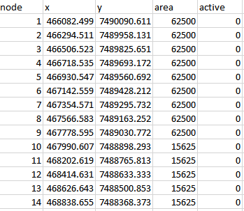
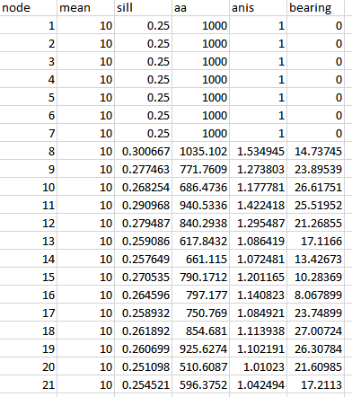
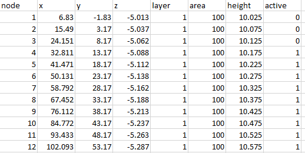
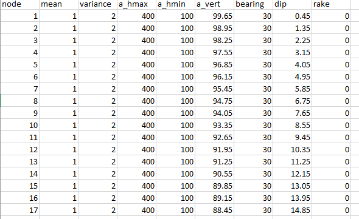

# PyPestUtils FORTRAN Shared Library Documentation

John Doherty, 2023

# Table of Contents

[Introduction](#introduction)

[Function Library](#function-library)

[Function Philosophy](#function-philosophy)

[Passing Text](#passing-text)

[Avoidance of Passing Text](#avoidance-of-passing-text)

[Function Return Value](#function-return-value)

[Model Pre-Processing Functions](#model-pre-processing-functions)

[calc_mf6_interp_factors](#calc_mf6_interp_factors)

[Description](#description)

[Function Call](#function-call)

[Return Value](#return-value)

[Function Arguments](#function-arguments)

[Notes](#notes)

[extract_flows_from_cbc_file](#extract_flows_from_cbc_file)

[Description](#description-1)

[Function Call](#function-call-1)

[Return Value](#return-value-1)

[Function Arguments](#function-arguments-1)

[Notes](#notes-1)

[free_all_memory](#free_all_memory)

[Description](#description-2)

[Function Call](#function-call-2)

[Return Value](#return-value-2)

[Function Arguments](#function-arguments-2)

[get_cell_centres_mf6](#get_cell_centres_mf6)

[Description](#description-3)

[Function Call](#function-call-3)

[Return Value](#return-value-3)

[Function Arguments](#function-arguments-3)

[Notes](#notes-2)

[get_cell_centres_structured](#get_cell_centres_structured)

[Description](#description-4)

[Function Call](#function-call-4)

[Return Value](#return-value-4)

[Function Arguments](#function-arguments-4)

[Notes](#notes-3)

[inquire_modflow_binary_file_specs](#inquire_modflow_binary_file_specs)

[Description](#description-5)

[Function Call](#function-call-5)

[Return Value](#return-value-5)

[Function Arguments](#function-arguments-5)

[Notes](#notes-4)

[install_mf6_grid_from_file](#install_mf6_grid_from_file)

[Description](#description-6)

[Function Call](#function-call-6)

[Return Value](#return-value-6)

[Function Arguments](#function-arguments-6)

[Notes](#notes-5)

[install_structured_grid](#install_structured_grid)

[Description](#description-7)

[Function Call](#function-call-7)

[Return Value](#return-value-7)

[Function Arguments](#function-arguments-7)

[Notes](#notes-6)

[interp_from_mf6_depvar_file](#interp_from_mf6_depvar_file)

[Description](#description-8)

[Function Call](#function-call-8)

[Return Value](#return-value-8)

[Function Arguments](#function-arguments-8)

[Notes](#notes-7)

[interp_from_structured_grid](#interp_from_structured_grid)

[Description](#description-9)

[Function Call](#function-call-9)

[Return Value](#return-value-9)

[Function Arguments](#function-arguments-9)

[Notes](#notes-8)

[interp_to_obstime](#interp_to_obstime)

[Description](#description-10)

[Function Call](#function-call-10)

[Return Value](#return-value-10)

[Function Arguments](#function-arguments-10)

[Notes](#notes-9)

[retrieve_error_message](#retrieve_error_message)

[Description](#description-11)

[Function Call](#function-call-11)

[Return Value](#return-value-11)

[Function Arguments](#function-arguments-11)

[Notes](#notes-10)

[uninstall_mf6_grid](#uninstall_mf6_grid)

[Description](#description-12)

[Function Call](#function-call-12)

[Return Value](#return-value-12)

[Function Arguments](#function-arguments-12)

[uninstall_structured_grid](#uninstall_structured_grid)

[Description](#description-13)

[Function Call](#function-call-13)

[Return Value](#return-value-13)

[Function Arguments](#function-arguments-13)

[Model Post-Processing Programs](#model-post-processing-programs)

[calc_kriging_factors_2d](#calc_kriging_factors_2d)

[Description](#description-14)

[Function Call](#function-call-14)

[Return Value](#return-value-14)

[Function Arguments](#function-arguments-14)

[Notes](#notes-11)

[calc_kriging_factors_auto_2d](#calc_kriging_factors_auto_2d)

[Description](#description-15)

[Function Call](#function-call-15)

[Return Value](#return-value-15)

[Function Arguments](#function-arguments-15)

[Notes](#notes-12)

[calc_kriging_factors_3d](#calc_kriging_factors_3d)

[Description](#description-16)

[Function Call](#function-call-16)

[Return Value](#return-value-16)

[Function Arguments](#function-arguments-16)

[Notes](#notes-13)

[krige_using_file](#krige_using_file)

[Description](#description-17)

[Function Call](#function-call-17)

[Function Arguments](#function-arguments-17)

[Notes](#notes-14)

[build_covar_matrix_2d](#build_covar_matrix_2d)

[Description](#description-18)

[Function Call](#function-call-18)

[Return Value](#return-value-17)

[Function Arguments](#function-arguments-18)

[Notes](#notes-15)

[build_covar_matrix_3d](#build_covar_matrix_3d)

[Description](#description-19)

[Function Call](#function-call-19)

[Return Value](#return-value-18)

[Function Arguments](#function-arguments-19)

[Notes](#notes-16)

[calc_structural_overlay_factors](#calc_structural_overlay_factors)

[Description](#description-20)

[Structural Overlay Parameters](#structural-overlay-parameters)

[Function Call](#function-call-20)

[Return Value](#return-value-19)

[Function Arguments](#function-arguments-20)

[Notes](#notes-17)

[interpolate_blend_using_file](#interpolate_blend_using_file)

[Description](#description-21)

[Function Call](#function-call-21)

[Return Value](#return-value-20)

[Function Arguments](#function-arguments-21)

[Notes](#notes-18)

[ipd_interpolate_2d](#ipd_interpolate_2d)

[Description](#description-22)

[Function Call](#function-call-22)

[Return Value](#return-value-21)

[Function Arguments](#function-arguments-22)

[Notes](#notes-19)

[ipd_interpolate \_3d](#ipd_interpolate-_3d)

[Description](#description-23)

[Function Call](#function-call-23)

[Return Value](#return-value-22)

[Function Arguments](#function-arguments-23)

[Notes](#notes-20)

[initialize_randgen](#initialize_randgen)

[Description](#description-24)

[Function Call](#function-call-24)

[Return Value](#return-value-23)

[Function Arguments](#function-arguments-24)

[Notes](#notes-21)

[fieldgen2d_sva](#fieldgen2d_sva)

[Description](#description-25)

[Some Theory](#some-theory)

[Function Call](#function-call-25)

[Function Arguments](#function-arguments-25)

[Notes](#notes-22)

[fieldgen3d_sva](#fieldgen3d_sva)

[Description](#description-26)

[Function Call](#function-call-26)

[Return Value](#return-value-24)

[Function Arguments](#function-arguments-26)

[Notes](#notes-23)

[Driver Programs](#driver-programs)

[Introduction](#introduction-1)

[DRIVER1](#driver1)

[DRIVER2](#driver2)

[DRIVER3](#driver3)

[DRIVER4](#driver4)

[Option 1](#option-1)

[Option 2](#option-2)

[Option 3](#option-3)

[Option 4](#option-4)

[Option 5](#option-5)

[Option 6](#option-6)

[DRIVER5](#driver5)

[DRIVER6](#driver6)

[DRIVER7](#driver7)

[DRIVER8](#driver8)

[DRIVER9](#driver9)

[DRIVER10](#driver10)

[DRIVER11](#driver11)

[DRIVER12](#driver12)

[DRIVER13](#driver13)

[DRIVER14](#driver14)

[General](#general-1)

[File Types](#file-types)

[Using DRIVER14](#using-driver14)

[DRIVER15](#driver15)

[General](#general-2)

[File Types](#file-types-1)

[Using DRIVER15](#using-driver15)

[DRIVER16](#driver16)

[DRIVER17](#driver17)

[References](#references)

# 

# 

# Introduction

## Function Library

Tasks that are provided in the *model_interface* library can be subdivided into two broad categories. The first is the performance of model preprocessing tasks. These tasks normally pertain to parameters. They include (but are not limited to) spatial interpolation from pilot points to a general model grid. The second set of tasks are model postprocessing tasks. These include the reading of model-generated files (normally binary files), and undertaking spatial and temporal interpolation of the contents of these files to the sites and times at which field measurements were made.

All library functions are accessible through the library file *model_interface.lib*.

## Function Philosophy

### Passing Text

Text is exchanged with the functions that comprise the *model_interface* library using one-dimensional character arrays. These are converted to FORTRAN CHARACTER variables internally. Presumably these character arrays are passed by address. Hence the receiving program does not know the length of the array. So it assumes a conservative length. The length does not matter unless a function writes to the array. Instances of this have been kept to a minimum. In fact they are restricted to the *retrieve_error_message()* function. Documentation of this function specifies the maximum number of elements that will be written, and hence the recommended size of the user-supplied receiving character array.

It is important that a user terminate any character array that it supplies to functions of *model_interface* library using an easily recognized character. In accordance with C convention, this character is “\\0” (i.e. ACHAR(0)). It is easy to employ another termination code if this is preferable.

### Avoidance of Passing Text

Because passing text is painful, integer flags are used instead of text flags where this is possible, for example to indicate file type, precision type, etc. (Note that the FORTRAN standard allows for C-interoperability of FORTRAN CHARACTER variables – up to a point. However this functionality is not employed in the functions that are documented herein in order to avoid any possibility of error in argument passing.)

## Function Return Value

All functions return an integer value. This value is zero unless an error condition arises. An error message can then be retrieved using function *retrieve_error_message()*. A call to this function must be made immediately after the function call in which the error condition was encountered.

# Model Pre-Processing Functions

## calc_mf6_interp_factors

### Description

Function *calc_mf6_interp_factors()* calculates interpolation factors from a MODFLOW 6 DIS or DISV grid to a set of user-supplied points. It records these factors in a text or binary interpolation factor file. This file can be used by other *model_interface* module functions such as *interp_from_mf6_depvar_file()*.

### Function Call

<table><colgroup><col style="width: 100%" /></colgroup><thead><tr class="header"><th>integer (kind=c_int) function calc_mf6_interp_factors( &amp; gridname, &amp; npts,ecoord,ncoord,layer, &amp; factorfile, factorfiletype, &amp; blnfile,interp_success) &amp; bind(c,name="calc_mf6_interp_factors_") use iso_c_binding, only: c_int,c_double,c_char character (kind=c_char,len=1), intent(in) :: gridname(*) integer(kind=c_int), intent(in) :: npts real(kind=c_double), intent(in) :: ecoord(npts),ncoord(npts) integer(kind=c_int), intent(in) :: layer(npts) character(kind=c_char,len=1), intent(in) :: factorfile(*) integer(kind=c_int), intent(in) :: factorfiletype character(kind=c_char,len=1), intent(in) :: blnfile(*) integer(kind=c_int), intent(out) :: interp_success(npts) end function calc_mf6_interp_factors </th></tr></thead><tbody></tbody></table>

### Return Value

The return value is zero unless an error condition is encountered, in which case the return value is 1. An error message can then be retrieved using function *retrieve_error_message()*.

### Function Arguments

| **Argument**   | **Role**                                                                                                                                                                                                                                    |
|----------------|---------------------------------------------------------------------------------------------------------------------------------------------------------------------------------------------------------------------------------------------|
| gridname       | The user-supplied name of an installed MODFLOW 6 grid specification.                                                                                                                                                                        |
| npts           | The number of points for which interpolation factors must be calculated.                                                                                                                                                                    |
| ecoord, ncoord | The eastings and northings of points to which interpolation must take place.                                                                                                                                                                |
| layer          | The model layer numbers to which interpolation target points belong.                                                                                                                                                                        |
| factorfile     | The file in which interpolation factors must be stored.                                                                                                                                                                                     |
| factorfiletype | Provide as 0 for a binary interpolation factor file, and 1 for an ASCII (i.e. text) interpolation factor file.                                                                                                                              |
| blnfile        | If this is provided with a nonblank value, then *calc_mf6_interp_factors()* writes a SURFER BLN file denoting polygons that contain interpolation target points. This polygon is a triangle for DISV grids, or a rectangle (for DIS grids). |
| interp_success | This is returned as 1 for points to which interpolation can take place, and as 0 for points to which interpolation cannot take place.                                                                                                       |

### Notes

#### Interpolation Methodology

For a DIS grid, function *calc_mf6_interp_factors()* implements bilinear interpolation from the four cell centres that surround each interpolation point (normally points at which system state observations have been made). If an observation point is not surrounded by four cell centres (this occurs if it lies outside of the model domain, or is too close to the edge of the model domain), then *calc_mf6_interp_factors()* reports its inability to interpolate to that point through the pertinent element of the *interp_success* array.

For a DISV grid, *calc_mf6_interp_factors()* attempts to construct a triangle of connected cell centres to enclose each point to which spatial interpolation is required (normally points at which system state observations have been made). If it cannot build a triangle, it tries to construct a quadrilateral of connected cell centres. If it cannot build a quadrilateral of enclosing, connected cell centres around a particular point, then *calc_mf6_interp_factors()* declares that interpolation cannot take place to that point. If a triangle can be found, interpolation is barycentric. If a quadrilateral must be used, then *calc_mf6_interp_factors()* performs barycentric interpolation from the two quadrilateral-forming triangles that enclose the observation point and averages the result.

It is important to note that all interpolation is two-dimensional. Interpolation to a particular point takes place only from cell centres which belong to the same model layer as that to which the point is assigned.

#### Coordinates

The geographical coordinates that are assigned to points to which spatial interpolation must take place should be consistent with those of the model. These can be real world coordinates, as MODFLOW 6 grid specifications include numbers which link a model grid to the real world. (XORIGIN, YORIGIN and ANGROT). These are applied when calculating interpolation factors.

#### The Interpolation Factor File

No point names are provided to subroutine *calc_mf6_interp_factors()*. Hence no point names are stored in the interpolation factor file that is written by this function. It is assumed that other functions of the *model_interface* module that use this file are aware of the ordering of points.

As a quality-assurance measure, point details (i.e. the eastings, northings and layers of points) are recorded before interpolation factors in the interpolation factor file that is written by function *calc_mf6_interp_factors()*. All user-supplied points are cited in this table, regardless of whether interpolation can take place to any particular point or not. The following table of interpolation factors also features all user-supplied points. However the integer which indicates the number of cell centres from which interpolation takes place to any point is assigned a value of zero for points to which spatial interpolation is impossible; no interpolation factors are associated with such points.

Entries on each line in the interpolation factor table are as follows:

1.  The number of cell centres from which interpolation takes place to the point;

2.  (Integer, real number) pairs comprised of the index of a cell centre and the interpolation factor associated with that cell centre.

## extract_flows_from_cbc_file

### Description

Function *extract_flows_from_cbc_file()* reads a cell-by-cell flow term file written by any version of MODFLOW (including MODFLOW-USG). It accumulates flows (normally pertaining to boundary conditions) over user-specified zones. Flows are stored in arrays that can be used by function *interp_to_obstime()* to conduct time-interpolation to observation times.

### Function Call

<table><colgroup><col style="width: 100%" /></colgroup><thead><tr class="header"><th>integer (kind=c_int) function extract_flows_from_cbc_file( &amp; cbcfile,flowtype,isim,iprec, &amp; ncell,izone,nzone, &amp; numzone,zonenumber, &amp; ntime,nproctime, &amp; timestep,stressperiod,simtime,simflow) &amp; bind(c,name="extract_flows_from_cbc_file_") use iso_c_binding, only: c_int,c_char,c_double character (kind=c_char,len=1), intent(in) :: cbcfile(*) character (kind=c_char,len=1), intent(in) :: flowtype(*) integer(kind=c_int), intent(in) :: isim integer(kind=c_int), intent(in) :: iprec integer(kind=c_int), intent(in) :: ncell integer(kind=c_int), intent(in) :: izone(ncell) integer(kind=c_int), intent(in) :: nzone integer(kind=c_int), intent(out) :: numzone integer(kind=c_int), intent(out) :: zonenumber(nzone) integer(kind=c_int), intent(in) :: ntime integer(kind=c_int), intent(out) :: nproctime integer(kind=c_int), intent(out) :: timestep(ntime) integer(kind=c_int), intent(out) :: stressperiod(ntime) real(kind=c_double), intent(out) :: simtime(ntime) real(kind=c_double), intent(out) :: simflow(ntime,nzone) end function extract_flows_from_cbc_file </th></tr></thead><tbody></tbody></table>

### Return Value

Function *extract_flows_from_cbc_file()* returns a value of zero unless an error condition is encountered, in which case it returns a value is 1. An error message can then be retrieved using function *retrieve_error_message()*.

### Function Arguments

<table><colgroup><col style="width: 23%" /><col style="width: 76%" /></colgroup><thead><tr class="header"><th><strong>Argument</strong></th><th><strong>Role</strong></th></tr></thead><tbody><tr class="odd"><td>cbcfile</td><td>The name of a cell-by-cell flow term file produced by any version of MODFLOW.</td></tr><tr class="even"><td>flowtype</td><td>Text that identifies a flow type of interest. This variable is used in a case-insensitive manner. It should uniquely identify a 16-character text string that precedes flow-type-pertinent tables or arrays in <em>cbcfile</em>.</td></tr><tr class="odd"><td>isim</td><td>An integer code which informs <em>extract_flows_from_cbc_file()</em> of the simulator that generated the binary file: 1 traditional MODFLOW; 21 MODFLOW-USG with structured grid; 22 MODFLOW-USG with unstructured grid; 31 MODFLOW 6 with DIS grid; 32 MODFLOW 6 with DISV grid; 33 MODFLOW 6 with DISU grid. </td></tr><tr class="even"><td>iprec</td><td>Indicates the precision with which real variables are stored in <em>cbcfile</em>. A value of 1 indicates single precision while a value of 2 indicates double precision.</td></tr><tr class="odd"><td>ncell</td><td>The number of cells in the model grid. For a structured grid model this is ncol ᵡ nrow ᵡ nlay. For a MODFLOW 6 DISV model this is NCPL ᵡ NLAY.</td></tr><tr class="even"><td>izone</td><td>An integer zonation array. It associates an integer with each cell of the model grid. Cells with the same integer belong to the same zone. Cells that are assigned an integer value of zero do not belong to any zone.</td></tr><tr class="odd"><td>nzone</td><td>A user-supplied positive integer which must equal or exceed the number of different zones which are featured in the <em>izone</em> array, that is the number of different non-zero-valued integers that are featured in this array.</td></tr><tr class="even"><td>numzone</td><td>The number of different zones in the <em>izone</em> array as determined by function <em>extract_flows_from_cbc_file()</em>. If <em>numzone</em> is found to exceed <em>nzone</em>, then <em>extract_flows_from_cbc_file()</em> will report an error condition.</td></tr><tr class="odd"><td>zonenumber</td><td>An array which lists <em>izone</em> zone numbers in order of increasing value. Note that zero is not a zone number.</td></tr><tr class="even"><td>ntime</td><td>A user-supplied number which should equal or exceed the number of simulation times for which cell-by-cell flow terms are recorded in <em>cbcfile</em>. This is also the size of the <em>timestep</em>, <em>stressperiod</em>, and <em>simtime</em> arrays provided to function <em>extract_flows_from_cbc_file()</em>. It is also the leading dimension of the <em>simflow</em> array. All of these arrays are filled by function <em>extract_flows_from_cbc_file()</em>.</td></tr><tr class="odd"><td>nproctime</td><td>The number of processed times. This is less than <em>ntime</em> if fewer than <em>ntime</em> simulation times are featured in <em>cbcfile</em>. If there are more than <em>ntime</em> simulation times featured in <em>cbcfile</em>, then <em>nproctime</em> is limited to <em>ntime</em>.</td></tr><tr class="even"><td>timestep</td><td>The simulation time steps for which <em>flowtype</em> flows are recorded in <em>cbcfile</em>, for up to <em>nproctime</em> output times.</td></tr><tr class="odd"><td>stressperiod</td><td>The simulation stress periods for which <em>flowtype</em> flows are recorded in <em>cbcfile</em>, for up to <em>nproctime</em> output times.</td></tr><tr class="even"><td>simtime</td><td>Simulation times for which <em>flowtype</em> flows are recorded in <em>cbcfile</em>, for up to <em>nproctime</em> output times.</td></tr><tr class="odd"><td>simflow</td><td>The flow in a particular zone at a particular output time.</td></tr></tbody></table>

### Notes

#### Zones

Function *extract_flows_from_cbc_file()* accumulates flows over zones. Zones are defined in the *izone* integer array. *extract_flows_from_cbc_file()* identifies all of the different non-zero integers that occur in this array and counts them. The total count is equal to *numzone*. It then sorts these integers in order of increasing value and returns them in the *zonenumber* array. Zones can then be referenced by array index in functions such as *interp_to_obstime()*. The *zonenumber* (and some other) arrays are given a dimension of *nzone* by the user. If *extract_flows_from_cbc_file()* establishes that *nzone* does not equal or exceed *numzone* it reports this as an error condition.

#### Contents of a Cell-by-Cell Flow Term File

The headers to all arrays and tables that appear in a cell-by-cell flow term file can be ascertained using function *inquire_modflow_binary_file_specs()*. Each array header includes a 16 character text identifier for each flow type at each output time. A user should provide one of these headers as the *flowtype* input variable (or enough of this header to allow its unique identification). Note, however, that *extract_flows_from_cbc_file()* will not extract flows between one cell and another internally to a model grid; it reports an error message if asked to do so. It is used to accumulate flows over part or all of a boundary condition type; that is, it accumulates flows of a certain type in or out of a model domain.

#### Simulation Times

The headers to flow arrays in cell-by-cell flow term files produced by newer versions of MODFLOW include the simulation time to which each array pertains. This is not the case for earlier versions of MODFLOW. Hence *extract_flows_from_cbc_file()* reports time steps and stress periods pertaining to accumulated flows in addition to the model simulation time that is associated (or not) with these accumulated flows. Where model simulation times are not provided in a cell-by-cell flow term file, a dummy simulation time of ‑1.0 is recorded by *extract_flows_from_cbc_file()*. It is the user’s responsibility to fill this array with correct simulation times prior to providing it to a function such as *interp_to_obstime()* that undertake time-interpolation of model outputs to user-supplied times of interest.

#### The simflow Output Array

The *simflow* array is dimensioned by the user. It is filled by function *extract_flows_from_cbc_file()*. If *ntime* exceeds the number of simulation times for which flow terms are reported in *cbcfile*, and/or *nzone* exceeds the number of zones that are present in the *izone* array, then pertinent elements of *simflow* cannot be filled by *extract_flows_from_cbc_file()*. These elements are provided with values of zero.

The second dimension of the *simflow* array links flows to zones. Linkage is by order. Thus the contents of *simflow(i,j)* are the accumulated flows in zone *j* at time *i*. The zone pertaining to index *j* is the *j*’th element of the *zonenumber* array. The time associated with index *i* is the *i’*th element of the *simtime* array. Note that a user of function *extract_flows_from_cbc_file()* does not need to be aware of its internal array indexing conventions. However, this does not apply to function *interp_to_obstime()* which uses this array. When calling the latter function, a user can assume that zonal indexing begins at zero.

## free_all_memory

### Description

This function deallocates all arrays that are used by the *model_interface* module for persistent storage.

### Function Call

<table><colgroup><col style="width: 100%" /></colgroup><thead><tr class="header"><th>integer (kind=c_int) function free_all_memory() bind(c,name="free_all_memory_") use iso_c_binding, only: c_int </th></tr></thead><tbody></tbody></table>

### Return Value

Function *free_all_memory()* returns a value of zero. In the unlikely event that arrays cannot be deallocated, it returns a value of 1. An error message to this effect can then be accessed using the *retrieve_error_message()* function.

### Function Arguments

Function *free_all_memory()* has no arguments.

## get_cell_centres_mf6

### Description

Function *get_cell_centres_mf6()* calculates the *x*, *y* and *z* coordinates of every cell of an installed MODFLOW 6 grid. Normally this grid will have been installed using function *install_mf6_grid_from_file()*.

### Function Call

<table><colgroup><col style="width: 100%" /></colgroup><thead><tr class="header"><th>integer (kind=c_int) function get_cell_centres_mf6( &amp; gridname, &amp; ncells, &amp; cellx,celly,cellz) &amp; bind(c,name="get_cell_centres_mf6_") use iso_c_binding, only: c_int,c_double,c_char character (kind=c_char,len=1), intent(in) :: gridname(*) integer(kind=c_int), intent(in) :: ncells real(kind=c_double), intent(out) :: cellx(ncells) real(kind=c_double), intent(out) :: celly(ncells) real(kind=c_double), intent(out) :: cellz(ncells) end function get_cell_centres_mf6 </th></tr></thead><tbody></tbody></table>

### Return Value

The function returns a value of zero unless an error condition is encountered, in which case it returns a value of 1. In the latter case, an error message can be retrieved using function *retrieve_error_message()*.

### Function Arguments

| **Argument**        | **Role**                                                                                                                                             |
|---------------------|------------------------------------------------------------------------------------------------------------------------------------------------------|
| gridname            | The user-supplied name for an installed set of MODFLOW 6 grid specification. As presently coded, this name must be 200 characters or less in length. |
| ncells              | The number of cells in the MODFLOW 6 grid.                                                                                                           |
| cellx, celly, cellz | The *x*, *y* and *z* coordinates of grid cell centres.                                                                                               |

### Notes

Every instance of a MODFLOW 6 grid specification must be provided with a unique name. As presently programmed, this name must be 200 characters or less in length. It is case-insensitive.

As is apparent from specifications of the above function call, a user must provide a value for *ncells*, the number of cells in the installed MODFLOW 6 grid. Dimensions of the user-supplied *cellx*, *celly* and *cellz* arrays must match this. Before calculating cell centre coordinates, function *get_cell_centres_mf6()* checks that *ncells* agrees with that specified for the installed model grid. If this is not the case, an error condition is reported.

For a structured grid, the ordering of cells in the *cellx*, *celly* and *cellz* arrays returned by function *get_cell_centres_mf6()* adheres to the MODFLOW convention. That is, element numbers increase fastest by column number, then row number, then layer number. Note also that for DIS and DISV grids, *cellx* and *celly* coordinates are repeated every *ncpl* cells where *ncpl* is the number of cells per layer.

The geographical location of a MODFLOW 6 grid is read from its binary grid file; see function *install_mf6_grid_from_file()* These are provided by the modeller as the XORIGIN, YORIGIN and ANGROT variables in the model’s discretization input file. Cell centre coordinates provided by function *get_cell_centres_mf6()* will, of course, be affected by the values of these grid specifications.

## get_cell_centres_structured

### Description

Function *get_cell_centres_structured()* calculates the *x* and *y* coordinates of all cells in a single layer of an installed structured model grid. Normally this grid will have been installed using function *install_structured_grid()*.

### Function Call

<table><colgroup><col style="width: 100%" /></colgroup><thead><tr class="header"><th>integer (kind=c_int) function get_cell_centres_structured( &amp; gridname, &amp; ncpl, &amp; cellx,celly) &amp; bind(c,name="get_cell_centres_structured_") use iso_c_binding, only: c_int,c_double,c_char character (kind=c_char,len=1), intent(in) :: gridname(*) integer(kind=c_int), intent(in) :: ncpl real(kind=c_double), intent(out) :: cellx(ncpl) real(kind=c_double), intent(out) :: celly(ncpl) end function get_cell_centres_structured </th></tr></thead><tbody></tbody></table>

### Return Value 

The function returns a value of zero unless an error condition is encountered, in which case it returns a value of 1. In the latter case, an error message can be retrieved using function *retrieve_error_message()*.

### Function Arguments

| **Argument** | **Role**                                                                                                                         |
|--------------|----------------------------------------------------------------------------------------------------------------------------------|
| gridname     | The user-supplied name for an installed structured grid. As presently coded, this name must be 200 characters or less in length. |
| ncpl         | The number of cells in a single layer of the structured grid.                                                                    |
| cellx, celly | The *x* and *y* coordinates of grid cell centres.                                                                                |

### Notes

Every instance of an installed structured grid must be provided with a unique name. As presently programmed, this name must be 200 characters or less in length. It is case-insensitive.

As is apparent from specifications of the above function call, a user must provide a value for *ncpl*, the number of cells in a single layer of the structured grid. This must be equal to the number of rows in the grid times the number of columns. Dimensions of the user-supplied *cellx* and *celly* arrays must match this. Before calculating cell centre coordinates, function *get_cell_centres_structured()* checks that *ncpl* agrees with that specified for the installed structured grid. If this is not the case, an error condition is reported.

For a structured grid, the ordering of cells in the *cellx* and *celly* arrays returned by function *get_cell_centres_structured()* adheres to the MODFLOW convention. That is, element numbers increase fastest by column number and then row number.

## inquire_modflow_binary_file_specs

### Description

Function *inquire_modflow_binary_file_specs()* reads a binary, dependent-variable or budget file that is written by MODFLOW, MODFLOW-USG or MODFLOW 6. It informs the user of the following file specifications:

-   whether the file is recorded in single or double precision;

-   the number of separate arrays that are recorded in the file;

-   the number of output times that are represented in the file. (This may be required for dimensioning arrays prior to making calls to functions such as *interp_from_structured_grid()*.)

Optionally, *inquire_modflow_binary_file_specs()* will write a tabular data file that lists all elements of the header to each array that it finds in the simulator output file.

### Function Call

<table><colgroup><col style="width: 100%" /></colgroup><thead><tr class="header"><th>integer (kind=c_int) function inquire_modflow_binary_file_specs( &amp; FileIn,FileOut,isim,itype,iprec,narray,ntime) &amp; bind(C,name="inquire_modflow_binary_file_specs_") use iso_c_binding, only: c_int,c_char character (kind=c_char), intent(in) :: FileIn(*) character (kind=c_char), intent(in) :: FileOut(*) integer(kind=c_int), intent(in) :: isim integer(kind=c_int), intent(in) :: itype integer(kind=c_int), intent(out) :: iprec integer(kind=c_int), intent(out) :: narray integer(kind=c_int), intent(out) :: ntime end function inquire_modflow_binary_file_specs </th></tr></thead><tbody></tbody></table>

### Return Value

The return value is zero unless an error condition is encountered, in which case it is 1. An error message can then be retrieved using function *retrieve_error_message()*.

### Function Arguments

<table><colgroup><col style="width: 23%" /><col style="width: 76%" /></colgroup><thead><tr class="header"><th><strong>Argument</strong></th><th><strong>Role</strong></th></tr></thead><tbody><tr class="odd"><td>filein</td><td>The name of the MODFLOW-generated binary file that must be read. The length of the filename should be 256 characters or less.</td></tr><tr class="even"><td>fileout</td><td>The name of a file to which function <em>inquire_modflow_binary_file_specs()</em> will write a table of array headers. (Supply this as blank for no output file.) The length of the filename should be 256 characters or less.</td></tr><tr class="odd"><td>isim</td><td>An integer code which informs the function of the simulator that generated the binary file: 1 traditional MODFLOW; 21 MODFLOW-USG with structured grid; 22 MODFLOW-USG with unstructured grid; 31 MODFLOW 6 with DIS grid; 32 MODFLOW 6 with DISV grid; 33 MODFLOW 6 with DISU grid. </td></tr><tr class="even"><td>itype</td><td>Type of file to read: 1 dependent variable; 2 cell-by-cell flow term. </td></tr><tr class="odd"><td>iprec</td><td>Precision used for real numbers: 1 single precision; 2 double precision. </td></tr><tr class="even"><td>narray</td><td>Number of arrays/tables recorded in the binary MODFLOW output file. Each array or table pertains to a flow or boundary condition type at a particular time. Each array or table is preceded by a header.</td></tr><tr class="odd"><td>ntime</td><td>The number of different times for which dependent variables or flow terms are recorded.</td></tr></tbody></table>

### Notes

As stated above, a termination character (“\\0”, i.e. ACHAR(0)) must be provided with string input arguments. For function *inquire_modflow_binary_file_specs()* these are filenames. The character arrays through which input and output filenames are provided should contain no greater than 256 elements. However they can have fewer elements than this if desired.

## install_mf6_grid_from_file

### Description

Function *install_mf6_grid_from_file()* reads a binary grid file (i.e. a GRB file) written by MODFLOW 6. This file contains all specifications of the grid of a MODFLOW 6 model, including its geographical reference point and rotation. *install_mf6_grid_from_file()* stores specifications for this grid for the future use of other *model_interface* functions such as *calc_mf6_interp_factors()* and *get_cell_centres_mf6()*.

Multiple instances of MODFLOW 6 grid specifications can be installed; as presently programmed, an upper limit of five is imposed.

### Function Call

<table><colgroup><col style="width: 100%" /></colgroup><thead><tr class="header"><th>integer (kind=c_int) function install_mf6_grid_from_file( &amp; gridname,grbfile, &amp; idis,ncells,ndim1,ndim2,ndim3) &amp; bind(c,name="install_mf6_grid_from_file_") use iso_c_binding, only: c_int,c_char character (kind=c_char,len=1), intent(in) :: gridname(*) character (kind=c_char,len=1), intent(in) :: grbfile(*) integer(kind=c_int), intent(out) :: idis integer(kind=c_int), intent(out) :: ncells integer(kind=c_int), intent(out) :: ndim1,ndim2,ndim3 end function install_mf6_grid_from_file </th></tr></thead><tbody></tbody></table>

### Return Value

The function returns a value of zero unless an error condition is encountered, in which case it returns a value of 1. In the latter case, an error message can be retrieved using function *retrieve_error_message()*.

### Function Arguments

| **Argument** | **Role**                                                                                                                                                                                                                                                      |
|--------------|---------------------------------------------------------------------------------------------------------------------------------------------------------------------------------------------------------------------------------------------------------------|
| gridname     | The user-supplied name for an installed set of MODFLOW 6 grid specification. As presently coded, this name must be 200 characters or less in length.                                                                                                          |
| grbfile      | The binary grid file, recorded by MODFLOW 6, from which grid specifications are read.                                                                                                                                                                         |
| idis         | This argument reports whether the MODFLOW 6 grid is of the DIS type (returned value of 1) or DISV type (returned value of 2). As presently coded, *install_mf6_grid_from file()* will object with an error message if the MODFLOW 6 grid is of the DISU type. |
| ncells       | The number of cells in the MODFLOW 6 grid.                                                                                                                                                                                                                    |
| ndim1        | Returned as the number of model columns (*ncol*) for a DIS grid or the number of model cells per layer (*ncpl*) for a DISV grid.                                                                                                                              |
| ndim1        | Returned as the number of model rows (*nrow*) for a DIS grid, or as 1 for a DISV grid.                                                                                                                                                                        |
| ndim3        | Returned as the number of model layers (*nlay*) for both DIS and DISV grids.                                                                                                                                                                                  |

### Notes

Every instance of a MODFLOW 6 grid specification must be provided with a unique name. As presently programmed, this name must be 200 characters or less in length. It is case-insensitive.

As presently programmed, functions of the *model_interface* module cannot accommodate a DISU grid. If the binary grid file which *install_mf6_grid_from_file()* is asked to read is written by a DISU-gridded model, an error condition arises. An error message can then be retrieved using the *retrieve_error_message()* function.

The geographical coordinates of a MODFLOW 6 grid are read from the binary grid file. These are provided by the modeller as the XORIGIN, YORIGIN and ANGROT variables in the model’s discretization input file. It is the user’s responsibility to ensure that the values of these variables are correct, and that they are therefore compatible with the coordinates of points for which interpolation factors will be calculated by other functions of the *model_interface* module.

For large models, storage of MODFLOW 6 grid specifications requires a lot of memory. It is recommended that a set of MODFLOW 6 specifications be uninstalled using function *uninstall_mf6_grid()* when no longer required.

## install_structured_grid

### Description

Function *install_structured_grid()* installs the specifications of a structured grid into the persistent memory of the *model_interface* module. These specifications are comprised of the following:

-   the number of rows, columns and layers in the model grid;

-   real world coordinates of either its top left or bottom left corner;

-   the anticlockwise rotation of the grid row direction from east;

-   the model grid DELR and DELC arrays.

Once grid specifications are installed, they can be used by functions such as *interp_from_structured_grid()*. The latter function can read binary dependent-variable files produced by structured MODFLOW, MT3D, MODFLOW-USG and MODFLOW 6 models.

Multiple instances of structured grid specifications can be installed; as presently programmed, an upper limit of five is imposed.

### Function Call

<table><colgroup><col style="width: 100%" /></colgroup><thead><tr class="header"><th>integer (kind=c_int) function install_structured_grid( &amp; gridname,ncol,nrow,nlay,icorner, &amp; e0,n0,rotation,delr,delc) &amp; bind(c,name="install_structured_grid_") use iso_c_binding, only: c_int,c_char,c_double character (kind=c_char), intent(in) :: gridname(*) integer (kind=c_int), intent(in) :: ncol,nrow,nlay integer (kind=c_int), intent(in) :: icorner real (kind=c_double), intent(in) :: e0,n0,rotation real (kind=c_double), intent(in) :: delr(ncol),delc(nrow) end function install_structured_grid </th></tr></thead><tbody></tbody></table>

### Return Value

The function returns a value of zero unless an error condition is encountered, in which case it returns a value of 1. In the latter case, an error message can then be retrieved using function *retrieve_error_message()*.

### Function Arguments

| **Argument** | **Role**                                                                                                                                                                                                       |
|--------------|----------------------------------------------------------------------------------------------------------------------------------------------------------------------------------------------------------------|
| gridname     | The user-supplied name of an installed structured grid specification. As presently coded, this name must be 200 characters or less in length.                                                                  |
| ncol         | The number of columns in the structured model grid.                                                                                                                                                            |
| nrow         | The number of rows in the structured model grid.                                                                                                                                                               |
| nlay         | The number of layers in the structured model grid.                                                                                                                                                             |
| icorner      | Supply as 1 or 2. If supplied as 1, *e0* and *n0* pertain to the top left corner of the structured model grid. If supplied as 2, *e0* and *n0* pertain to the bottom left corner of the structured model grid. |
| e0           | Real-world eastern coordinate of model grid corner.                                                                                                                                                            |
| n0           | Real-world northern coordinate of model grid corner.                                                                                                                                                           |
| rotation     | Counter-clockwise rotation of row direction of model grid from east.                                                                                                                                           |
| delr         | Row widths of model cells                                                                                                                                                                                      |
| delc         | Column widths of model cells.                                                                                                                                                                                  |

### Notes

Every instance of an installed structured grid specification must be provided with a unique name. As presently programmed, this name must be 200 characters or less in length. It is case-insensitive.

Specifications of a structured model grid are also provided in a “grid specification file” that is supported by the PEST Groundwater Utilities. In this file, *e0* and *n0* pertain to the top left corner of the grid (i.e. *icorner* option 1). Also, a grid specification file does not record the number of layers in a model grid.

## interp_from_mf6_depvar_file

### Description

Function *interp_from_mf6_depvar_file()* reads a dependent-variable file written by MODFLOW 6. For every output time that is recorded in this file, it undertakes spatial interpolation of model-calculated dependent variables to a set of points. Spatial interpolation is implemented using factors that were previously calculated by function *calc_mf6_interp_factors()*.

Arrays used by *interp_from_mf6_depvar_file()* to store spatial interpolation outcomes are useable by function *interp_to_obstime()*. Hence temporal interpolation to observation times can follow spatial interpolation to observation sites.

### Function Call

<table><colgroup><col style="width: 100%" /></colgroup><thead><tr class="header"><th>integer (kind=c_int) function interp_from_mf6_depvar_file( &amp; depvarfile,factorfile,factorfiletype, &amp; ntime,vartype,interpthresh,reapportion,nointerpval, &amp; npts,nproctime,simtime,simstate) &amp; bind(c,name="interp_from_mf6_depvar_file_") use iso_c_binding, only: c_int,c_char,c_double character(kind=c_char,len=1), intent(in) :: depvarfile(*) character(kind=c_char,len=1), intent(in) :: factorfile(*) integer(kind=c_int), intent(in) :: factorfiletype integer(kind=c_int), intent(in) :: ntime character (kind=c_char,len=1), intent(in) :: vartype(*) real(kind=c_double), intent(in) :: interpthresh integer(kind=c_int), intent(in) :: reapportion real(kind=c_double), intent(in) :: nointerpval integer(kind=c_int), intent(in) :: npts integer(kind=c_int), intent(out) :: nproctime real(kind=c_double), intent(out) :: simtime(ntime) real(kind=c_double), intent(out) :: simstate(ntime,npts) end function interp_from_mf6_depvar_file </th></tr></thead><tbody></tbody></table>

### Return Value

Function *interp_from_mf6_depvar_file()* returns a value of zero unless an error condition is encountered. In that case it returns a value of 1. An error message can then be retrieved using function *retrieve_error_message()*.

### Function Arguments

| **Argument**   | **Role**                                                                                                                                                                                                                                                                                                                                                                                                                                                                                                                                                                                                                                                                                                                                                                                                                    |
|----------------|-----------------------------------------------------------------------------------------------------------------------------------------------------------------------------------------------------------------------------------------------------------------------------------------------------------------------------------------------------------------------------------------------------------------------------------------------------------------------------------------------------------------------------------------------------------------------------------------------------------------------------------------------------------------------------------------------------------------------------------------------------------------------------------------------------------------------------|
| depvarfile     | The name of a binary dependent-variable file written by MODFLOW 6.                                                                                                                                                                                                                                                                                                                                                                                                                                                                                                                                                                                                                                                                                                                                                          |
| factorfile     | The name of an interpolation factor file written by function *calc_mf6_interp_factors()*. The factors that are recorded in this file must pertain to the same MODFLOW 6 grid as that to which the dependent variable file pertains.                                                                                                                                                                                                                                                                                                                                                                                                                                                                                                                                                                                         |
| factorfiletype | 0 for binary, or 1 for ASCII.                                                                                                                                                                                                                                                                                                                                                                                                                                                                                                                                                                                                                                                                                                                                                                                               |
| ntime          | The first dimension of the *simtime* and *simstate* arrays. Generally, this should equal or exceed the number of simulation times for which model outputs are available in *depvarfile*. However if *ntime* is less than this, only dependent variables corresponding to the first *ntime* times that are recorded in the dependent variable file are processed.                                                                                                                                                                                                                                                                                                                                                                                                                                                            |
| vartype        | Each array in a dependent variable file contains a 16 character text header. *vartype* provides (case-insensitive) text that allows unique identification of a header of interest. Only variables of this type will be processed by function *interp_from_mf6_depvar_file()*.                                                                                                                                                                                                                                                                                                                                                                                                                                                                                                                                               |
| interpthresh   | If the absolute value of a model-calculated dependent variable is equal to, or greater than *interpthresh*, its value is treated as invalid. This may, for example, indicate a dry or inactive model cell.                                                                                                                                                                                                                                                                                                                                                                                                                                                                                                                                                                                                                  |
| reapportion    | If a cell from which spatial interpolation takes place is endowed with a dependent variable value which exceeds *interpthresh* then this can be handled in one of two ways. If *reapportion* is provided as 0, then the point-interpolated value is also declared to be invalid; hence it is assigned a value of *nointerpval*. However if reapportion is supplied as 1, then interpolation to the point may still take place. Other factors which feature in the interpolation process to that point are then adjusted so that they add to 1.0. However if all cells from which interpolation takes place are endowed with dependent variable values which are greater than *interpthresh*, then spatial interpolation to that point becomes impossible; the point is then awarded an interpolated value of *nointerpval*. |
| nointerpval    | Function *interp_from_mf6_depvar_file()* assigns a value of *nointerpval* to any point for which spatial interpolation is impossible. This can occur if the point lies outside the MODFLOW 6 grid. It can also occur if surrounding model cells are dry or inactive.                                                                                                                                                                                                                                                                                                                                                                                                                                                                                                                                                        |
| npts           | The number of points to which interpolation takes place. This is the second dimension of the *simstate* array. This same value should have been supplied to function *calc_mf6_interp_factors()* when it calculated point interpolation factors. Its value is recorded at the top of the interpolation factor file which the latter function writes. If the value of *npts* supplied to function *interp_from_mf6_depvar_file()* does not agree with this value, an appropriate error message is generated.                                                                                                                                                                                                                                                                                                                 |
| nproctime      | Function *interp_from_mf6_depvar_file()* informs a calling program of the number of separate simulation times for which it undertakes spatial interpolation through this variable. Note that the value assigned to *nproctime* will not exceed the user-supplied value of *ntime,* as *interp_from_mf6_depvar_file()* does not process simulator-generated data pertaining to more than *ntime* simulation times.                                                                                                                                                                                                                                                                                                                                                                                                           |
| simtime        | Simulation times for which values of dependent variables have been calculated are recorded in this array. Time values beyond *nproctime* are returned as *nointerpval*.                                                                                                                                                                                                                                                                                                                                                                                                                                                                                                                                                                                                                                                     |
| simstate       | This two-dimensional array contains spatially-interpolated values of dependent variables. The ordering of points is the same as in the *ecoord* and *ncoord* arrays that were provided to function *calc_mf6_interp_factors()* when it calculated interpolation factors. The ordering of times is the same as that encountered in the dependent variable output file that was written by MODFLOW 6.                                                                                                                                                                                                                                                                                                                                                                                                                         |

### Notes

#### Complementary Functions

Use of function *interp_from_mf6_depvar_file()* complements that of function *calc_mf6_interp_factors()*. Spatial interpolation factors that were calculated by the latter function can be used to interpolate many sets of dependent variables that reside in one or a number of binary, MODFLOW 6 dependent variable files using function *interp_from_mf6_depvar_file()*. However this implies that spatial interpolation of all of these dependent variables takes place to the same set of points.

Use of function *interp_from_mf6_depvar_file()* also complements that of function *interp_to_obstime()*. The latter function undertakes temporal interpolation, presumably to the times at which observations of system state were made. This function requires use of *nproctime*, as well as the *simtime* and *simstate* arrays that are filled by function *interp_from_mf6_depvar_file()*.

#### Ordering of Points

The eastings and northings of points to which spatial interpolation must take place were supplied to function *calc_mf6_interp_factors()* through the *ecoord* and *ncoord* arrays that are required by that function. These arrays host coordinates for *npts* points, where *npts* is another *calc_mf6_interp_factors()* input variable.

Function *interp_from_mf6_depvar_file()* also requires a value for *npts*. This must be the same as that which was previously supplied to *calc_mf6_interp_factors()*. The ordering of points in the *simstate* array (these pertain to the second dimension of that array) is the same as that in the *ecoord* and *ncoord* arrays that were previously supplied to *calc_mf6_interp_factors()*. Meanwhile, the ordering of times in the *simtime* and *simstate* arrays is the same as that for which system states are recorded in the MODFLOW 6 dependent variable file.

#### Inability to Interpolate

As is described in documentation to function *calc_mf6_interp_factors()*, spatial interpolation to user-specified points is barycentric for a DISV grid, and bilinear for a DIS grid. However, as is also explained in its documentation, function *calc_mf6_interp_factors()* does not actually undertake spatial interpolation; it simply calculates the factors which enable spatial interpolation to take place.

Spatial interpolation of model-calculated dependent variables to a particular point in space requires that the values of dependent variables that are calculated for model cells be multiplied by these factors and summed. For any interpolation point, these factors sum to 1.0. Hence the spatially interpolated value of a dependent variable is the weighted average of dependent variable values ascribed to the centres of model cells that surround it.

If the dependent variable value ascribed to a particular model cell equals or exceeds *interpthresh,* then this value cannot be used in the spatial interpolation process. Function *interp_from_mf6_depvar_file()* provides two options for handling this situation. The appropriate option can be selected through its *reapportion* input argument. A *reapportion* value of 0 instructs *interp_from_mf6_depvar_file()* to endow any point for which spatial interpolation requires use of an above-*interpthresh* dependent variable value with an interpolated value of *no_interpval*. Alternatively, if *reapportion* is supplied as 1, then the above-*interpthresh* value is omitted from the interpolation process; other spatial interpolation factors pertaining to the point of interest are then adjusted so that they sum to 1.0.

#### Dependent Variable Types

On most occasions of MODFLOW 6 usage, a single dependent variable type is stored in each dependent variable file. The type of variable is recognized by a 16 character descriptor that is provided in the header to each array that is stored in the file.

There may be circumstances, however, where more than one dependent variable type is stored in a single dependent variable file. Function *interp_from_mf6_depvar_file()* allows processing of only one dependent variable at a time. This variable must be denoted by the user using the *vartype* function argument. Supply a set of characters that allows unique identification of the variable type of interest from its header. For example “he” or even “h” can be used to identify heads arrays, if heads are the only type of dependent variable that is stored in a dependent variable file. Array identifiers for different dependent variable types are listed in the MODFLOW 6 manual. Those that are featured in a particular binary dependent variable file can be ascertained using function *inquire_modflow_binary_file_specs()*.

#### Array Precision

Function *interp_from_mf6_depvar_file()* assumes that all real numbers are stored in double precision in a dependent variable file. At the time of writing, this is a MODFLOW 6 specification.

## interp_from_structured_grid

### Description

Function *interp_from_structured_grid()* undertakes layer-specific (i.e. two-dimensional) spatial interpolation from dependent-variable arrays that are recorded in binary simulator output files. Interpolation takes place to user-specified points. The simulator can be MODFLOW, MT3D, MODFLOW-USG or MODFLOW 6. An important requirement for the latter two simulators is that the model employs a structured grid.

### Function Call

<table><colgroup><col style="width: 100%" /></colgroup><thead><tr class="header"><th>integer (kind=c_int) function interp_from_structured_grid( &amp; GridName,DepVarFile,isim,iprec,ntime, &amp; VarType,InterpThresh,NoInterpVal, &amp; npts,ecoord,ncoord,layer, &amp; nproctime,simtime,simstate) &amp; bind(c,name="interp_from_structured_grid_") use iso_c_binding, only: c_int,c_double,c_char character (kind=c_char), intent(in) :: gridname(*) character (kind=c_char), intent(in) :: depvarfile(*) integer(kind=c_int), intent(in) :: isim integer(kind=c_int), intent(in) :: iprec integer(kind=c_int), intent(in) :: ntime character (kind=c_char), intent(in) :: vartype(*) real(kind=c_double), intent(in) :: interpthresh real(kind=c_double), intent(in) :: nointerpval integer(kind=c_int), intent(in) :: npts real(kind=c_double), intent(in) :: ecoord(npts),ncoord(npts) integer(kind=c_int), intent(in) :: layer(npts) integer(kind=c_int), intent(out) :: nproctime real(kind=c_double), intent(out) :: simtime(ntime) real(kind=c_double), intent(out) :: simstate(ntime,npts) end function interp_from_structured_grid </th></tr></thead><tbody></tbody></table>

### Return Value

Function *interp_from_structured_grid()* returns a value of zero unless an error condition is encountered, in which case it returns a value of 1. In the latter case, an error message can then be retrieved using function *retrieve_error_message()*.

### Function Arguments

| **Argument** | **Role**                                                                                                                                                                                                                                                                                                                                                                                                                                                                                                                                                                                                                    |
|--------------|-----------------------------------------------------------------------------------------------------------------------------------------------------------------------------------------------------------------------------------------------------------------------------------------------------------------------------------------------------------------------------------------------------------------------------------------------------------------------------------------------------------------------------------------------------------------------------------------------------------------------------|
| gridname     | The name of an installed structured grid.                                                                                                                                                                                                                                                                                                                                                                                                                                                                                                                                                                                   |
| depvarfile   | The name of a binary dependent-variable file. This file may have been written by MODFLOW, MT3D, MODFLOW-USG or MODFLOW 6. It must pertain to a structured grid.                                                                                                                                                                                                                                                                                                                                                                                                                                                             |
| isim         | This argument must be supplied as 1 or -1. Supply a value of 1 for a file produced by any version of MODFLOW. Supply a value of -1 for a file written by MT3D.                                                                                                                                                                                                                                                                                                                                                                                                                                                              |
| iprec        | Provide a value of 1 or 2. 1 indicates single precision while 2 indicated double precision.                                                                                                                                                                                                                                                                                                                                                                                                                                                                                                                                 |
| ntime        | This is used for dimensioning arrays that *interp_from_structured_grid()* will fill with interpolated values of model-calculated dependent variables. If *ntime* is greater than the number of times for which model outputs are recorded in *depvarfile*, then elements pertaining to non-represented simulation times are assigned a value of *nointerpval*. If *ntime* is less than the number of model simulation times that are featured in *depvarfile*, spatially-interpolated model outputs pertaining only to the first *ntime* simulation times are represented in *interp_from_structured_grid()* output arrays. |
| vartype      | It is possible that a dependent-variable output file contains calculated values for more than a single dependent variable. Dependent variable types are identified by array headers. Provide the dependent variable type for which interpolation to user-supplied points is required using the *vartype* argument.                                                                                                                                                                                                                                                                                                          |
| interpthresh | If the absolute value of a dependent variable assigned to a model cell is above this threshold, then interpolation does not take place from that cell. The cell is assumed to be inactive or dry.                                                                                                                                                                                                                                                                                                                                                                                                                           |
| nointerpval  | This value is provided to elements of *interp_from_structured_grid()* output arrays where spatial interpolation is impossible.                                                                                                                                                                                                                                                                                                                                                                                                                                                                                              |
| npts         | The number of points to which spatial interpolation is required.                                                                                                                                                                                                                                                                                                                                                                                                                                                                                                                                                            |
| ecoord       | Point east coordinates.                                                                                                                                                                                                                                                                                                                                                                                                                                                                                                                                                                                                     |
| ncoord       | Point north coordinates.                                                                                                                                                                                                                                                                                                                                                                                                                                                                                                                                                                                                    |
| layer        | The model layers to which points belong.                                                                                                                                                                                                                                                                                                                                                                                                                                                                                                                                                                                    |
| nproctime    | Function *interp_from_structured_grid()* informs a calling program of the number of separate simulation times for which it undertakes spatial interpolation through this variable. Note that the value assigned to *nproctime* will not exceed the user-supplied value of *ntime* as *interp_from_structured_grid()* does not process simulator-generated data pertaining to more than *ntime* simulation times.                                                                                                                                                                                                            |
| simtime      | Simulation times are recorded in this array. Time values beyond *nproctime* are returned as *nointerpval*.                                                                                                                                                                                                                                                                                                                                                                                                                                                                                                                  |
| simstate     | This two-dimensional array contains spatially-interpolated values of dependent variables. The ordering of points is the same as in the user-supplied *ecoord* and *ncoord* arrays. The ordering of times is the same as that encountered in the dependent variable output file.                                                                                                                                                                                                                                                                                                                                             |

### Notes

#### Interpolation Scheme

Function *interp_from_structured_grid()* performs within-layer, bilinear interpolation from the centres of model cells to points of user interest. This interpolation scheme accommodates dry and inactive cells. By setting pertinent simulator input variables (for example HNOFLO and HDRY) to appropriate values before running a model, a user must ensure that such cells are easily recognizable.

A number with a high absolute value must be used to denote inactive and dry cells. This absolute value value must be higher than that of *interpthresh*. That is, a “calculated” system state whose absolute value is greater than *interpthresh* is assumed to be dry or inactive.

Interpolation will not take place to a user-supplied point under the following circumstances:

-   The point lies outside the model grid;

-   The point is surrounded by the centres of four dry or inactive model cells.

Interpolation can take place to a point which lies inside the model grid, but is beyond the first/last row/column of (active) model cells. Obviously, interpolation to such a point can only be approximate. To prevent interpolation to such points, ensure they are not included in the set of points that is supplied to function *interp_from_structured_grid()* through its *ecoord* and *ncoord* arguments.

Where interpolation cannot take place to a point, its interpolated value is set to the user-supplied value of *nointerpval.*

#### Knowledge of File Contents

Some of the argument values required by function *interp_from_structured_grid()* require knowledge of the contents of the binary file which is read by this function. In particular, a user must know:

-   array text headers;

-   the precision with which real numbers are recorded;

-   the number of times for which simulator outputs are recorded.

For all but MT3D output files, this information can be obtained using function *inquire_modflow_binary_file_specs()*.

#### Model Output Times

Ideally the value of the *ntime* argument should be the same as the number of simulation times for which calculated system states are recorded in the binary dependent-variable file *depvarfile*. If *ntime* is greater than this, then elements of the *simstate* array that pertain to unpresented model output times are filled with dummy spatially-interpolated system state values of *nointerpval*. If *ntime* is provided with a value that is less than the number of times for which simulation outputs are provided in file *depvarfile*, then spatial interpolation takes place for only the first *ntime* simulation times.

#### Dependent Variable Types

A MODFLOW-compatible dependent-variable file often provides values for only a single type of dependent variable (i.e. for a single system state). This state type is listed as a 16 character text string in the header to each array that is recorded in *depvarfile*. Examples are “HEAD”, “DRAWDOWN” and “SUBSIDENCE”. On most occasions of model usage, different types of model-computed state arrays are recorded in different binary output files.

However, there may be some occasions on which this protocol is not followed. A common example is where concentrations of different chemical species are recorded in a single MODFLOW-USG binary output file.

A user specifies what type of system state data are to be processed using the *vartype* argument of function *interp_from_structured_grid()*. Enough characters must be provided in this variable to uniquely identify the requested dependent-variable type. For example “d” can identify HEAD arrays in a file that contains only head arrays. However it cannot uniquely identify HEAD arrays in a binary output file that contains both HEAD and DRAWDOWN arrays. Where a dependent variable type is not uniquely identifiable, interpolated values pertaining to one dependent variable type will be overwritten by those pertaining to another dependent variable type whenever both of them are recorded at the same simulation type. Obviously, this is an undesirable state of affairs. It can be avoided by supplying the full name of a dependent variable through the *vartype* argument. Function *inquire_modflow_binary_file_specs()* can be used to ascertain these full names from array text headers.

#### Grid Real World Coordinates

The real world location of a structured model grid is recorded in its specifications. These are stored using function *install_structured_grid()*.

A binary grid file which is written by MODFLOW 6 also contains information that links a model grid to real world coordinates. However function *interp_from_structured_grid()* does not read this file. Hence if the real-world location of a MODFLOW 6 grid as recorded in its binary grid file differs from that which is installed in its structured grid specifications, then *interp_from_structured_grid()* has no way of knowing about this conflict.

Similarly, the real-world coordinates of a structured-grid MODFLOW-USG model may be recorded in its (rather extensive) grid specification file. *Interp_from_structured_grid()* makes no reference to this file. It relies purely on geographical information that is installed with pertinent structured grid specifications using function *install_structured_grid()*.

## interp_to_obstime

### Description

Function *interp_to_obstime()* undertakes time-interpolation of quantities that were previously read from simulator output files, and possibly spatially interpolated to a set of user-supplied points. The times to which time-interpolation takes place are normally the times at which field observations were made.

Arrays that store the outcomes of spatial interpolation or boundary flow extraction are useable by function *interp_to_obstime()*.

### Function Call

<table><colgroup><col style="width: 100%" /></colgroup><thead><tr class="header"><th>integer (kind=c_int) function interp_to_obstime( &amp; nsimtime,nproctime,npts,simtime,simval, &amp; interpthresh,how_extrap,time_extrap,nointerpval, &amp; nobs,obspoint,obstime,obssimval) &amp; bind(c,name="interp_to_obstime_") use iso_c_binding, only: c_int,c_double,c_char integer(kind=c_int), intent(in) :: nsimtime integer(kind=c_int), intent(in) :: nproctime integer(kind=c_int), intent(in) :: npts real(kind=c_double), intent(in) :: simtime(nsimtime) real(kind=c_double), intent(in) :: simval(nsimtime,npts) real(kind=c_double), intent(in) :: interpthresh character(kind=c_char,len=1),intent(in) :: how_extrap real(kind=c_double), intent(in) :: time_extrap real(kind=c_double), intent(in) :: nointerpval integer(kind=c_int), intent(in) :: nobs integer(kind=c_int), intent(in) :: obspoint(nobs) real(kind=c_double), intent(in) :: obstime(nobs) real(kind=c_double), intent(out) :: obssimval(nobs) end function interp_to_obstime </th></tr></thead><tbody></tbody></table>

### Return Value

Function *interp_to_obstime()* returns a value of 0. However if an error condition is encountered, it returns a value of 1. An error message can then be retrieved using the *retrieve_error_message()* function.

### Function Arguments

| **Argument**   | **Role**                                                                                                                                                                                                                                                                                                                                                                                                                                                                                                                                                                                                                                                                                                        |
|----------------|-----------------------------------------------------------------------------------------------------------------------------------------------------------------------------------------------------------------------------------------------------------------------------------------------------------------------------------------------------------------------------------------------------------------------------------------------------------------------------------------------------------------------------------------------------------------------------------------------------------------------------------------------------------------------------------------------------------------|
| nsimtime       | First dimension of arrays *simtime* and *simval*.                                                                                                                                                                                                                                                                                                                                                                                                                                                                                                                                                                                                                                                               |
| nproctime      | Number of times featured in arrays *simtime* and *simval*. *nproctime* must not exceed *nsimtime*.                                                                                                                                                                                                                                                                                                                                                                                                                                                                                                                                                                                                              |
| npts           | Second dimension of array *simval*. This is the number of points or zones for which temporal interpolation must take place.                                                                                                                                                                                                                                                                                                                                                                                                                                                                                                                                                                                     |
| simtime        | This array contains simulation times for which model outputs are available. The *simtime* array will normally have been filled by functions such as *interp_from_structured_grid()*, *interp_from_mf6_depvar_file()* or *extract_flows_from_cbc_file()*.                                                                                                                                                                                                                                                                                                                                                                                                                                                        |
| simval         | Like the *simtime* array, this array will normally have been filled by functions such as *interp_from_structured_grid()*, *interp_from_mf6_depvar_file()* and *extract_flows_from_cbc_file()*. In the first two cases, it contains spatially-interpolated, model-simulated values at times for which these have been read from a binary model dependent-variable output file In the second case it contains zone-accumulated flows extracted from a model-generated cell-by-cell flow term file. In both cases, these values are available at *nproctime* times. Functions *interp_from_structrured_grid()*, *interp_from_mf6_depvar_file()* and *extract_flows_from_cbc_file()* assign a value to *nproctime*. |
| *interpthresh* | If the absolute value of a quantity in the *simval* array exceeds *interpthresh*, then its value is treated with suspicion by *interp_to_obstime()*. See following notes.                                                                                                                                                                                                                                                                                                                                                                                                                                                                                                                                       |
| *how_extrap*   | Supply this as “L” or “C”. “L” signifies linear while “C” signifies constant.                                                                                                                                                                                                                                                                                                                                                                                                                                                                                                                                                                                                                                   |
| *time_extrap*  | The time over which time-extrapolation (in contrast to interpolation) is allowed. This must be supplied as 0.0 or greater.                                                                                                                                                                                                                                                                                                                                                                                                                                                                                                                                                                                      |
| *noninterpval* | If time-interpolation cannot take place to a certain point or zone at a certain time, then a dummy time-interpolated value of *noninterpval* is provided.                                                                                                                                                                                                                                                                                                                                                                                                                                                                                                                                                       |
| *nobs*         | The number of times (normally observation times) to which time-interpolation must be undertaken.                                                                                                                                                                                                                                                                                                                                                                                                                                                                                                                                                                                                                |
| *obspoint*     | The indices of points or zones to which time-interpolation is undertaken. These pertain to the *simval* *npts* array dimension, starting at 0. If a point or zone is not referenced in the *simval* array, provide an index of -1. No temporal interpolation is therefore possible to this point or zone.                                                                                                                                                                                                                                                                                                                                                                                                       |
| *obstime*      | Times to which time-interpolation must take place, presumably times at which observations were made. The time units and reference time must be the same as for elements of the *simtime* array; presumably these are model simulation times.                                                                                                                                                                                                                                                                                                                                                                                                                                                                    |
| *obssimval*    | Time interpolated values. Times correspond to times provided in *obstime*. Points or zones correspond to indices provided in *obspoint*.                                                                                                                                                                                                                                                                                                                                                                                                                                                                                                                                                                        |

### Notes

#### General Usage

As stated above, normally function *interp_to_obstime()* is called following a call to a function such as *interp_from_structured_grid()*, *interp_from_mf6_depvar_file()* and *extract_flows_from_cbc_file()*. Function *interp_from_structured_grid()* and *interp_from_mf6_depvar_file()* undertake spatial interpolation of system states that are extracted from a binary MODFLOW-generated dependent variable file. Function *extract_flows_from_cbc_file()* does not undertake spatial interpolation; however it accumulates flow rates over use-specified zones.

Where spatial interpolation has preceded a call to *interp_to_obstime()*, the geographical coordinates of points to which spatial interpolation took place were supplied to respective spatial interpolation functions. *Interp_to_obstime()* undertakes temporal interpolation for these same points. These points are referenced by their *simval* array *npts* index. These indices are presumed to start at 0. The ordering of points is the same as that supplied to the spatial interpolation function.

Following a call to *extract_flows_from_cbc_file()* the *simval* array may contain zone-accumulated flows at model output times. Zone numbers for which flow was accumulated are referenced by index in the second dimension of the *simval* array. Hence in this case, *npts* actually refers to the number of zones for which flow was accumulated rather than to the number of points to which system states had previously been spatially interpolated. Zone indices start at zero. The zone with an index of zero is that with the lowest zone number, that with an index of 1 is that with the next highest zone number etc. Zone numbers are extracted from a model-specific inter zonation array by function *extract_flows_from_cbc_files()*. They are listed (after sorting) in the *zonenumber()* array that is produced by this function. The zone number index refers to this array.

Times from which interpolation takes place are recorded in the *simtime* array. These are generally model simulation times. *interp_to_obstime()* checks that these times are provided in increasing order. Efficiency of its time-interpolation algorithm depends on this.

In contrast, times that are provided in the *obstime* array do not need to be in increasing order. In fact, this is unlikely, as the times at which field measurements of system state or flux were made are normally different for different points or zones.

As stated above, temporal interpolation of model-originating values that are recorded in the *simval* array to observation times that are recorded in the *obstime* array requires that points to which spatial interpolation has already taken place or zones over which flow accumulation has already taken place be identified. These are identified by their *simval* *npts* index, starting at 0. If a user-supplied point or zone does not correspond to a *simval*-indexed point or zone, then the *obspoint* index for this point should be supplied as -1. “Interpolated” values for this point or zone are then assigned values of *nointerpval* at all observation times that are associated with it.

#### Interpolation Scheme

Time-interpolation is linear if an observation time lies between two simulation times.

#### Extrapolation

If an observation time lies before the first simulation time or after the last simulation time, then temporal extrapolation (rather than interpolation) is required. Three extrapolation options are provided.

The first option is to assign a value at the extrapolated time that is equal to that of the first or last simulation time. The second is to undertake linear extrapolation from the first two or last two simulation times. The third is to forbid extrapolation. The last option is implemented by setting *time_extrap* to 0.0. *time_extrap* is the time over which extrapolation is allowed. If an observation time precedes the first simulation time by more than this amount, or postdates the last simulation time by more than this amount, then its “extrapolated” value is *nointerpval*.

#### Dummy Simulated Values

In functions such as *interp_from_structured_grid()* and *interp_from_mf6_depvar_file()*, a dummy model-generated value is assigned at points and times at which spatial interpolation is impossible. This may occur if, for example, a point is outside the model grid, or because a point is temporarily or permanently surrounded by dry or inactive cells. These dummy values must be recognizable as being larger in absolute value than *interpthresh*.

If temporal interpolation of model-generated values to observation times requires use of a *simval* element whose absolute value is greater than *interpthresh*, then the time-interpolated value ascribed to the pertinent *obssimval* element is assigned a value of *nointerpval* as interpolation/extrapolation is considered to be unreliable under these circumstances.

## retrieve_error_message

### Description

Function *retrieve_error_message()* returns an error message. This is a non-blank string if the previous *model_inferface* module function call returned an error condition.

### Function Call

<table><colgroup><col style="width: 100%" /></colgroup><thead><tr class="header"><th>integer(kind=c_int) function retrieve_error_message(errormessage) &amp; bind(c, name="retrieve_error_message_") use iso_c_binding, only: c_int,c_char character (kind=c_char), intent(out) :: errormessage(*) end function retrieve_error_message </th></tr></thead><tbody></tbody></table>

### Return Value

Function *retrieve_error_message()* returns a value of 0. However if the error message string is not empty, it returns a value of 1.

### Function Arguments

| **Argument** | **Role**                                                                                                                                            |
|--------------|-----------------------------------------------------------------------------------------------------------------------------------------------------|
| errorstring  | A character array of length 1500 containing an error message. This message is terminated by the string termination character “\\0” (i.e. ACHAR(0)). |

### Notes

If a *model_interface* module function experiences an error condition, then an error message string is available until the next function call. During this subsequent call, it is assigned a blank value, or is overwritten by another error message.

The user-supplied character array to which this error message is written should be at least 1500 characters in length. If this is not the case, there is a risk of inadvertent memory over-write.

## uninstall_mf6_grid

### Description

This function acts as a complement to *install_mf6_grid_from_file()*. As the name implies, it uninstalls previously-installed specifications of a MODFLOW 6 grid. In doing this, it deallocates the considerable amount of memory that may be required to store the complete specifications of this grid.

### Function Call

<table><colgroup><col style="width: 100%" /></colgroup><thead><tr class="header"><th>integer (kind=c_int) function uninstall_mf6_grid(gridname) &amp; bind(c,name="uninstall_mf6_grid_") use iso_c_binding, only: c_int,c_char character (kind=c_char,len=1), intent(in) :: gridname(*) end function uninstall_mf6_grid </th></tr></thead><tbody></tbody></table>

### Return Value

Function *uninstall_mf6_grid()* returns a value of zero unless an error condition arises. This will occur if the MODFLOW 6 grid nominated through the *gridname* argument is not actually installed, or if some problem is encountered in deallocating memory.

### Function Arguments

| **Argument** | **Role**                                                                                                                              |
|--------------|---------------------------------------------------------------------------------------------------------------------------------------|
| gridname     | The name of a MODFLOW 6 grid which requires removal. As presently programmed, this name can be a maximum of 200 characters in length. |

## uninstall_structured_grid

### Description

This function acts as a complement to *install_structured_grid()*. As the name implies, it uninstalls previously-installed specifications of a structured grid. In doing this, it deallocates memory that is used to house the DELR and DELC arrays pertaining to this grid.

### Function Call

<table><colgroup><col style="width: 100%" /></colgroup><thead><tr class="header"><th>integer (kind=c_int) function uninstall_structured_grid(gridname) &amp; bind(c,name="uninstall_structured_grid_") use iso_c_binding, only: c_int,c_char character (kind=c_char), intent(in) :: gridname(*) end function uninstall_structured_grid </th></tr></thead><tbody></tbody></table>

### Return Value

Function *uninstall_structured_grid()* returns a value of zero unless an error condition arises. This will occur if the structured grid nominated through the *gridname* argument is not actually installed, or if some problem is encountered in deallocating memory.

### Function Arguments

| **Argument** | **Role**                                                                                                                   |
|--------------|----------------------------------------------------------------------------------------------------------------------------|
| gridname     | The name of an installed structured grid. As presently programmed, this name can be a maximum of 200 characters in length. |

# Model Post-Processing Programs

## calc_kriging_factors_2d

### Description

The task performed by function *calc_kriging_factors_2d()* resembles that performed by a PLPROC function of the same name. As the name suggests, this function calculates kriging factors. More accurately, it calls modified functions of the GSLIB library (Deutsch and Journel, 1998) to calculate kriging factors. These factors will often be used to implement spatial interpolation from pilot points to a model grid. However function *calc_kriging_factors_2d()* makes no mention of either pilot points nor a model grid. The set of points to which spatial interpolation takes place are specified only by their coordinates. These can be the centres of cells of a structured or unstructured model grid. Alternatively, they may have no relationship to a model grid whatsoever.

Other features of *calc_kriging_factors_2d* include the following:

-   Kriging can be simple or ordinary;

-   Kriging can be based on a Gaussian, exponential, spherical or power variogram;

-   The specifications of this variogram (i.e. its range, anisotropy and anisotropy direction) can be spatially variable. A value for each of these specifications is assigned to every point to which spatial interpolation is required (often every cell within a model grid). Values for these specifications may have been interpolated to these cells using a previous call to this, or another, interpolation function; alternatively, they may be spatially invariant.

*calc_kriging_factors_2d()* records the kriging factors that it calculates in a so-called “factor file”. This file can be binary or text. Interpolation factors can be used by function *krige_using_file()*. It is through this latter function that other variables required by the interpolation process are provided. These include source values (e.g. hydraulic property values associated with pilot points), mean values at target point locations (if simple kriging is undertaken), and whether interpolation must be based on native source point values or the logs of source point values.

### Function Call

<table><colgroup><col style="width: 100%" /></colgroup><thead><tr class="header"><th>integer (kind=c_int) function calc_kriging_factors_2d( &amp; npts,ecs,ncs,zns, &amp; mpts,ect,nct,znt, &amp; vartype,krigtype, &amp; aa,anis,bearing, &amp; searchrad,maxpts,minpts, &amp; factorfile,factorfiletype, &amp; icount_interp) use iso_c_binding, only: c_int,c_char,c_double integer(kind=c_int), intent(in) :: npts real(kind=c_double), intent(in) :: ecs(npts),ncs(npts) integer(kind=c_int), intent(in) :: zns(npts) integer(kind=c_int), intent(in) :: mpts real(kind=c_double), intent(in) :: ect(mpts),nct(mpts) integer(kind=c_int), intent(in) :: znt(mpts) integer(kind=c_int), intent(in) :: vartype integer(kind=c_int), intent(in) :: krigtype real(kind=c_double), intent(in) :: aa(mpts) real(kind=c_double), intent(in) :: anis(mpts) real(kind=c_double), intent(in) :: bearing(mpts) real(kind=c_double), intent(in) :: searchrad integer(kind=c_int), intent(in) :: maxpts, minpts character (kind=c_char,len=1), intent(in) :: factorfile(*) integer(kind=c_int), intent(in) :: factorfiletype integer(kind=c_int), intent(out) :: icount_interp end function calc_kriging_factors_2d </th></tr></thead><tbody></tbody></table>

### Return Value

Function *calc_kriging_factors_2d()* returns a value of zero unless an error condition is encountered, in which case it returns a value of 1. In the latter case, an error message can then be retrieved using function *retrieve_error_message()*.

### Function Arguments

| **Argument**   | **Role**                                                                                                                                                                              |
|----------------|---------------------------------------------------------------------------------------------------------------------------------------------------------------------------------------|
| npts           | Number of source points (often pilot points).                                                                                                                                         |
| ecs, ncs       | East and north coordinates of source points.                                                                                                                                          |
| zns            | Zone numbers of source points.                                                                                                                                                        |
| mpts           | Number of target points (often cells of a model grid).                                                                                                                                |
| ect, nct       | East and north coordinates of target points.                                                                                                                                          |
| znt            | Zone numbers of target points.                                                                                                                                                        |
| vartype        | Variogram type; 1 = spherical; 2= exponential; 3 = Gaussian; 4 = power.                                                                                                               |
| krigtype       | Type of kriging: 0 = simple; 1 = ordinary.                                                                                                                                            |
| aa             | Variogram “a” value.                                                                                                                                                                  |
| anis           | Ratio of variogram “a” value in principle direction of anisotropy to that in the orthogonal direction. The principle direction of anisotropy is that given by the *bearing* argument. |
| bearing        | Principle direction of anisotropy measured in degrees clockwise from north.                                                                                                           |
| searchrad      | The search radius; only points within this distance of a target point are used in kriging to that point.                                                                              |
| maxpts         | Only the closest *maxpts* points to a target point are used for interpolation to that point.                                                                                          |
| minpts         | If there are less than *minpts* points within a distance of *searchrad* of a target point, an error condition arises, and is reported to the calling program.                         |
| factorfile     | The name of the file in which interpolation factors are recorded.                                                                                                                     |
| factorfiletype | Whether the factor file is text or binary: 0 = binary; 1 = text.                                                                                                                      |
| icount_interp  | Returned as the number of target points for which interpolation factors were calculated.                                                                                              |

### Notes

#### Zones

Each source point and each target point must be assigned an integer zone number. This is done using the *zns* and *znt* arrays respectively. Interpolation to a target point is only undertaken from source points which lie within the same zone as that of the target point. It is important to note, however, that no interpolation takes place to target points whose zone number is zero.

Suppose that a target point belongs to zone *N*. If no source point belongs to this same zone, then *calc_kriging_factors_2d()* reports an error message.

#### Variograms

Formulas for variograms are as follows. “a” values supplied through the *aa* function argument pertain to *a* featured in each of these equations. *a* must be supplied as greater than zero.

*Spherical*

 if *h* \< *a*

 if *h* ≥ *a*

*Exponential*

*Gaussian*

*Power*

Note that a variogram sill is not required by function *calc_kriging_factors_2d()*. This is only required when a variogram is accompanied by a nugget. *calc_kriging_factors_2d()* does not require a nugget.

#### Spatially-Varying Variograms

As discussed above, variogram properties must be supplied in arrays whose dimensions are equal to the number of target points. If variogram properties are not spatially variable, then it is still necessary to provide these properties as arrays. In this case, of course, all elements of each array have the same value.

#### Interpolation

Once kriging factors have been calculated and stored, interpolation can be carried out using function *krige-using_file()*.

## calc_kriging_factors_auto_2d

### Description

Function *calc_kriging_factors_auto_2d()* has a similar role to the PLPROC function of the same name. As the name implies, it calculates kriging factors for two-dimensional interpolation. As for function *calc_kriging_factors_2d()*, specifications of the variogram on which kriging is based can be spatially variable. However *calc_kriging_factors_auto_2d()* requires fewer arguments than the latter function, as it determines the variogram range itself based on local pilot point spatial density. It also works out for itself the local source point search radius; hence a user does not need to supply this as a function argument. Nor does he/she need to supply the maximum/minimum number of source points to employ in interpolation to a target point.

### Function Call

<table><colgroup><col style="width: 100%" /></colgroup><thead><tr class="header"><th>integer (kind=c_int) function calc_kriging_factors_auto_2d( &amp; npts,ecs,ncs,zns, &amp; mpts,ect,nct,znt, &amp; krigtype, &amp; anis,bearing, &amp; factorfile,factorfiletype, &amp; icount_interp) use iso_c_binding, only: c_int,c_char,c_double integer(kind=c_int), intent(in) :: npts real(kind=c_double), intent(in) :: ecs(npts),ncs(npts) integer(kind=c_int), intent(in) :: zns(npts) integer(kind=c_int), intent(in) :: mpts real(kind=c_double), intent(in) :: ect(mpts),nct(mpts) integer(kind=c_int), intent(in) :: znt(mpts) integer(kind=c_int), intent(in) :: krigtype real(kind=c_double), intent(in) :: anis(mpts) real(kind=c_double), intent(in) :: bearing(mpts) character (kind=c_char,len=1), intent(in) :: factorfile(*) integer(kind=c_int), intent(in) :: factorfiletype integer(kind=c_int), intent(out) :: icount_interp end function calc_kriging_factors_auto_2d </th></tr></thead><tbody></tbody></table>

### Return Value

Function *calc_kriging_factors_auto_2d()* returns a value of zero unless an error condition is encountered, in which case it returns a value of 1. In the latter case, an error message can then be retrieved using function *retrieve_error_message()*.

### Function Arguments

| **Argument**   | **Role**                                                                                                                                                                              |
|----------------|---------------------------------------------------------------------------------------------------------------------------------------------------------------------------------------|
| npts           | Number of source points (often pilot points).                                                                                                                                         |
| ecs, ncs       | East and north coordinates of source points.                                                                                                                                          |
| zns            | Zone numbers of source points.                                                                                                                                                        |
| mpts           | Number of target points (often cells of a model grid).                                                                                                                                |
| ect, nct       | East and north coordinates of target points.                                                                                                                                          |
| znt            | Zone numbers of target points.                                                                                                                                                        |
| krigtype       | Type of kriging: 0 = simple; 1 = ordinary.                                                                                                                                            |
| anis           | Ratio of variogram “a” value in principle direction of anisotropy to that in the orthogonal direction. The principle direction of anisotropy is that given by the *bearing* argument. |
| bearing        | Principle direction of anisotropy measured in degrees clockwise from north.                                                                                                           |
| factorfile     | The name of the file in which interpolation factors are recorded.                                                                                                                     |
| factorfiletype | Whether the factor file is text or binary: 0 = binary; 1 = text.                                                                                                                      |
| icount_interp  | Returned as the number of target points for which interpolation factors were calculated.                                                                                              |

### Notes

Function *calc_kriging_factors_auto_2d()* employs an exponential variogram. Hence no variogram type argument is required. Because it calculates the variogram range itself based on local pilot point spatial density, problems that can sometimes occur where source point separations are very different in different parts of an interpolation domain are avoided.

Other arguments that are absent from function *calc_kriging_factors_auto_2d()* but that are present in function *calc_kriging_factors_2d()* are the *searchrad, maxpts* and *minpts* arguments. *calc_kriging_factors_auto_2d()* works these out for itself. In doing this, it attempts to maximize the efficiency of the interpolation factor calculation process, while minimizing the size of the interpolation factor file that it writes. Its algorithm seems to work satisfactorily on most occasions. However a user should check that interpolated hydraulic property fields do not exhibit a “paintbrush effect”. These are local discontinuities that arise as source points move in and out of the interpolation search radius of neighbouring target points.

Argument of the same name in functions *calc_kriging_factors_2d()* and *calc_kriging_factors_auto_2d()* perform similar roles. Refer to documentation of the former program for a discussion of the use of zones and spatially varying anisotropy.

## calc_kriging_factors_3d

### Description

Function *calc_kriging_factors_3d()* implements three-dimensional kriging. As for other kriging functions provided by the *model_interface* library, kriging factors are actually calculated by subroutines that were modified from the GSLIB geostatistical software library (Deutsch and Journel, 1998). The tasks that *calc_kriging_factors_3d()* performs are similar to those performed by the PLPROC function of the same name.

Kriging factors calculated by *calc_kriging_factors_3d()*can be used to implement spatial interpolation from pilot points to a model grid. However function *calc_kriging_factors_3d()* makes mention of neither pilot points nor a model grid. The set of points to which spatial interpolation takes place are specified only by their coordinates. These can be the centres of cells of a structured or unstructured grid. Alternatively, they may have no relationship to a model grid whatsoever.

Other features of *calc_kriging_factors_3d* include the following:

-   Kriging can be simple or ordinary;

-   Kriging can be based on a Gaussian, exponential, spherical or power variogram;

-   The specifications of this variogram can be zone-based.

*calc_kriging_factors_3d()* records the kriging factors that it calculates in a so-called “factor file”. This file can be binary or text. Interpolation factors are used by function *krige_using_file()*. As is recorded in documentation of this function, *krige_using_file()* requires further inputs that are required by the spatial interpolation process. These include source values (e.g. hydraulic property values at pilot point locations), mean hydraulic property values at target point locations (if simple kriging is undertaken), and whether interpolation is based on native source point values or the logs of source point values.

### Function Call

<table><colgroup><col style="width: 100%" /></colgroup><thead><tr class="header"><th>integer (kind=c_int) function calc_kriging_factors_3d( &amp; npts,ecs,ncs,zcs,zns, &amp; mpts,ect,nct,zct,znt, &amp; krigtype, &amp; nzone,zonenum, &amp; vartype, &amp; ahmax,ahmin,avert, &amp; bearing,dip,rake, &amp; srhmax,srhmin,srvert, &amp; maxpts,minpts, &amp; factorfile,factorfiletype, &amp; icount_interp) use iso_c_binding, only: c_int,c_char,c_double integer(kind=c_int), intent(in) :: npts real(kind=c_double), intent(in) :: ecs(npts),ncs(npts),zcs(npts) integer(kind=c_int), intent(in) :: zns(npts) integer(kind=c_int), intent(in) :: mpts real(kind=c_double), intent(in) :: ect(mpts),nct(mpts),zct(mpts) integer(kind=c_int), intent(in) :: znt(mpts) integer(kind=c_int), intent(in) :: krigtype integer(kind=c_int), intent(in) :: nzone integer(kind=c_int), intent(in) :: zonenum(nzone) integer(kind=c_int), intent(in) :: vartype(nzone) real(kind=c_double), intent(in) :: ahmax(nzone),ahmin(nzone),avert(nzone) real(kind=c_double), intent(in) :: bearing(nzone) real(kind=c_double), intent(in) :: dip(nzone) real(kind=c_double), intent(in) :: rake(nzone) real(kind=c_double), intent(in) :: srhmax real(kind=c_double), intent(in) :: srhmin real(kind=c_double), intent(in) :: srvert integer(kind=c_int), intent(in) :: maxpts, minpts character (kind=c_char,len=1), intent(in) :: factorfile(*) integer(kind=c_int), intent(in) :: factorfiletype integer(kind=c_int), intent(out) :: icount_interp end function calc_kriging_factors_3d </th></tr></thead><tbody></tbody></table>

### Return Value

Function *calc_kriging_factors_3d()* returns a value of zero unless an error condition is encountered, in which case it returns a value of 1. In the latter case, an error message can then be retrieved using function *retrieve_error_message()*.

### Function Arguments

| **Argument**   | **Role**                                                                                                                                                                                        |
|----------------|-------------------------------------------------------------------------------------------------------------------------------------------------------------------------------------------------|
| npts           | Number of source points (often pilot points).                                                                                                                                                   |
| ecs, ncs, zcs  | East, north and vertical coordinates of source points.                                                                                                                                          |
| zns            | Zone numbers of source points.                                                                                                                                                                  |
| mpts           | Number of target points (often cells of a model grid).                                                                                                                                          |
| ect, nct, zct  | East, north and vertical coordinates of target points.                                                                                                                                          |
| znt            | Zone numbers of target points.                                                                                                                                                                  |
| krigtype       | Type of kriging: 0 = simple; 1 = ordinary.                                                                                                                                                      |
| nzone          | Number of zones to which source and target points belong.                                                                                                                                       |
| zonenum        | Numbers assigned to zones.                                                                                                                                                                      |
| vartype        | Variogram type; 1 = spherical; 2= exponential; 3 = Gaussian; 4 = power.                                                                                                                         |
| ahmax          | Variogram “*a*” value in principle direction of anisotropy (normally horizontal, or nearly so).                                                                                                 |
| ahmin          | Variogram “*a*” value in direction of medium anisotropy (normally horizontal, or nearly so).                                                                                                    |
| avert          | Variogram “*a*” value in a direction that is perpendicular to that of *ahmax* and *ahmin* (normally vertical, or nearly so).                                                                    |
| bearing        | Direction (in degrees) of the horizontal projection of the *ahmax* direction measured in degrees clockwise from north. *bearing* must exceed -360 degrees and be less than 360 degrees.         |
| dip            | Dip, in degrees, of the *ahmax* direction. In accordance with GSLIB conventions, a downwards dip of the positive *ahmax* axis is negative. *dip* must lie between -180 degrees and 180 degrees. |
| rake           | Rotation, in degrees, of the *ahmin* and *avert* directions about the *ahmax* axis. See below.                                                                                                  |
| srhmax         | Search radius in the *ahmax* direction.                                                                                                                                                         |
| srhmin         | Search radius in the *ahmin* direction.                                                                                                                                                         |
| srvert         | Search radius in the *avert* direction.                                                                                                                                                         |
| maxpts         | Only the closest *maxpts* source points that lie with the search envelope will be used for spatial interpolation to a target point.                                                             |
| minpts         | If fewer than *minpts* source points lie within the search envelope of a target point, an error condition results.                                                                              |
| factorfile     | The name of the file in which interpolation factors are recorded.                                                                                                                               |
| factorfiletype | Whether the factor file is text or binary: 0 = binary; 1 = text.                                                                                                                                |
| icount_interp  | Returned as the number of target points for which interpolation factors were calculated.                                                                                                        |

### Notes

#### Zones

Prior to calling function *calc_kriging_factors_3d()*, the calling program should fill the *zonenum* array with integers that denote zones that are allocated to both source and target points. Interpolation only takes place from and to points that lie within the same zone. These zones are designated in the *zns* and *znt* arrays for source and target points respectively. However, no interpolation takes place to or from points which lie in zone 0. Hence source and target points which belong to zone 0 are ignored. It is optional whether a zone number of 0 is supplied in the *zonenum* array; if it is supplied, then it too is ignored.

It is important to note, however, that any zone number (except zero) that features in any one of the *zns*, *znt* and *zonenum* arrays must be featured in all of them. If this is not the case, function *calc_kriging_factors_3d()* will report an error condition.

#### The Ellipse of Anisotropy

See Deutsch and Journel (1998) and Remy et al (2011) for a full description.

*ahmax*, *ahmin* and *avert* provide variogram *a* values in three orthogonal directions. The first two of these directions are presumed to approximate horizontal (though this is not essential); the third is therefore approximately vertical. *ahmax* is normally larger than *ahmin* (though this is not essential).

*Bearing* must lie between -360 degrees and 360 degrees. This is the direction in which the horizontal projection of the positive direction of the *ahmax* axis points. It is measured clockwise from north. *Dip* is the angle (positive above ground level) in which the positive direction of the *ahmax* axis points.

Values for *dip* can vary between -180 degrees and 180 degrees.

To understand the meaning of *rake*, picture yourself looking down the *a_hmax* axis from its positive end towards its negative end. Now picture the ellipsoid of anisotropy being rotated anticlockwise about this *a_hmax* axis so that the positive direction of the *a_hmin* axis rises. The angle by which it rises is the *rake*. The value supplied for *rake* must lie between -90 degrees and 90 degrees.

Note that the positive directions of each of the *a_hmax*, *a_hmin* and *a_vert* axes form a right hand coordinate system. A screw that is turned from positive *a_hmax* to positive *a_hmin* therefore advances in the *a_vert* direction.

#### Search Radii

The higher are the values that are supplied for *srhmax*, *srhmin* and *srvert*, the longer does *calc_kriging_factors_3d()* require to do its work, and the larger is the interpolation factor file that it writes. However the interpolated hydraulic property field is likely to be smooth, as no interpolation discontinuities are introduces as source points move in and out of the search radii of neighbouring target points.

#### Interpolation

The factor file which is written by *calc_kriging_factors_3d()* is read by function *krige_using_file()*. This is the function that interpolates values associated with source points to the locations of target points.

### 

## krige_using_file

### Description

Function *krige_using_file()* reads an interpolation factor file written by any of the following functions:

-   *calc_kriging_factors_2d()*

-   *calc_kriging_factors_auto_2d()*

-   *calc_kriging_factors_3d()*

It then implements spatial interpolation based on these functions.

### Function Call

<table><colgroup><col style="width: 100%" /></colgroup><thead><tr class="header"><th>integer (kind=c_int) function krige_using_file( &amp; factorfile,factorfiletype, &amp; npts,mpts, &amp; krigtype,transtype, &amp; sourceval,targval, &amp; icount_interp, &amp; meanval) use iso_c_binding, only: c_int,c_char,c_double character (kind=c_char,len=1), intent(in) :: factorfile(*) integer(kind=c_int), intent(in) :: factorfiletype integer(kind=c_int), intent(in) :: npts integer(kind=c_int), intent(in) :: mpts integer(kind=c_int), intent(in) :: krigtype integer(kind=c_int), intent(in) :: transtype real(kind=c_double), intent(in) :: sourceval(npts) real(kind=c_double), intent(out) :: targval(mpts) integer(kind=c_int), intent(out) :: icount_interp real(kind=c_double), intent(in), optional :: meanval(mpts) end function krige_using_file </th></tr></thead><tbody></tbody></table>

### Function Arguments

| **Argument**   | **Role**                                                                                              |
|----------------|-------------------------------------------------------------------------------------------------------|
| factorfile     | Name of the file in which interpolation factors are stored.                                           |
| factorfiletype | Whether the factor file is text or binary: 0 = binary; 1 = text.                                      |
| npts           | Number of source points.                                                                              |
| mpts           | Number of target points.                                                                              |
| krigtype       | Type of kriging: 0 = simple; 1 = ordinary.                                                            |
| transtype      | Whether interpolation is applied to native or log values: 0 = native; 1=log.                          |
| sourceval      | Values at source points that require spatial interpolation.                                           |
| targval        | Interpolated values at target points.                                                                 |
| icount_interp  | The number of target points to which interpolation takes place.                                       |
| meanval        | Mean values at target points. This is an optional argument. It must be supplied if kriging is simple. |

### Notes

#### Quality Assurance

As stated above, function *krige_using_file()* uses kriging factors that are calculated by other functions. These functions write the interpolation factor file which *krige_using_file()* reads. The *sourceval* argument of *krige_using_file()* must contain values that are associated with source locations that were provided to these factor-file-generating functions. The number of elements in this array must therefore be the same as the number of elements in complementary arrays provided to the preceding functions. *krige_using_file()* checks that this is the case. It can do this because the value of *npts* is recorded in the factor file.

Similar considerations apply to the *targval* argument. The value of *mpts* that is provided in a call to function *krige_using_file()* is compared with that recorded in the factor file. If they are not the same, an error condition is reported. An error will also be reported if factors were calculated for simple kriging by the function which wrote the factor file, while ordinary kriging is requested in a call to *krige_using_file()*.

A further check on quality assurance is enabled by the *icount_interp* function argument. Functions which write the factor file which *krige_using_file()* reads return a value for this variable. The same value should be returned by *krige_using_file()*.

Note that these quality assurance measures are not full proof. Values of *npts* and *mpts* may be the same in sequential calls to a factor-generating function and *krige_using_file()*. However, if a user is not careful, the ordering of points within respective source and target arrays may be different. This error cannot be detected.

#### Simple Kriging

Simple kriging requires that a mean value be associated with all target points. Under conditions of geostatistical stationarity, this mean value is the same for all points. However, as has been discussed, neither *krige_using_file()* nor its complementary factor-file-generating programs rely on an assumption of stationarity. Hence the mean value can be different at every target point. Because of this, *krige_using_file()* requires that an array of mean values be supplied for target points. If stationarity prevails, then all values supplied in this array should be the same.

#### Transformation

Interpolation can take place either in the log domain or in the domain of natural numbers. In the former case, source values are log-transformed by *krige_using_file()* before being interpolated to target points. Interpolated values at target points are then back-transformed to the domain of natural numbers before being assigned to them. If any source point value is zero or negative, this precipitates an error condition (because only positive numbers can be log-transformed); *krige_using_file()* then provides an appropriate error message.

If kriging is simple, user-supplied target point mean values must also be greater than zero. If any of them are zero or negative, an error condition is reported. Note, however, that they must be supplied to *krige_using_file()* as natural numbers. *krige_using_file()* log-transforms them before using them.

## build_covar_matrix_2d

### Description

Function *build_covar_matrix_2d()* builds a covariance matrix for a set of two-dimensional pilot points whose eastings, northings and zone numbers are provided. It calls functions from the GSLIB library to perform covariance calculation. The covariance between any two points is calculated using a variogram. However variogram properties can vary from point to point. Where variogram properties are different for two points for which the covariance must calculated, the smaller of the two covariances is adopted.

### Function Call

<table><colgroup><col style="width: 100%" /></colgroup><thead><tr class="header"><th>integer (kind=c_int) function build_covar_matrix_2d( &amp; npts,ec,nc,zn, &amp; vartype, &amp; nugget,aa,sill,anis,bearing, &amp; ldcovmat,covmat) use iso_c_binding, only: c_int,c_double integer(kind=c_int), intent(in) :: npts real(kind=c_double), intent(in) :: ec(npts),nc(npts) integer(kind=c_int), intent(in) :: zn(npts) integer(kind=c_int), intent(in) :: vartype real(kind=c_double), intent(in) :: nugget(npts) real(kind=c_double), intent(in) :: aa(npts) real(kind=c_double), intent(in) :: sill(npts) real(kind=c_double), intent(in) :: anis(npts) real(kind=c_double), intent(in) :: bearing(npts) integer(kind=c_int), intent(in) :: ldcovmat real(kind=c_double), intent(out) :: covmat(ldcovmat,npts) end function build_covar_matrix_2d </th></tr></thead><tbody></tbody></table>

### Return Value

Function *build_covar_matrix_2d()* returns a value of zero unless an error condition is encountered, in which case it returns a value of 1. In the latter case, an error message can be retrieved using function *retrieve_error_message()*.

### Function Arguments

| **Argument** | **Role**                                                    |
|--------------|-------------------------------------------------------------|
| npts         | Number of pilot points.                                     |
| ecs, ncs     | East and north coordinates of pilot points.                 |
| zns          | Zone numbers of pilot points.                               |
| vartype      | The variogram type used for covariance calculation.         |
| nugget       | Variogram nugget.                                           |
| aa           | Value of “a” appearing in variogram equation.               |
| sill         | Variogram sill.                                             |
| anis         | Variogram anisotropy.                                       |
| bearing      | Bearing of principle anisotropy axis.                       |
| ldcovmat     | The leading dimension of the user-supplied *covmat* matrix. |
| covmat       | The covariance matrix which is filled.                      |

### Notes

#### Variogram Parameters

As is apparent from the above specifications, variogram properties can vary from pilot point to pilot point. Hence they must be supplied as arrays. The number of elements in each of these arrays must be the same as the number of pilot points.

A covariance matrix must be positive definite. Function *build_covar_matrix_2d()* ensures this by first calculating a trial covariance matrix using spatially varying variogram properties, and then subjecting this matrix to singular value decomposition. Positive definiteness can then be acquired by flipping one or other of the corresponding left or right eigenvectors of the trial covariance matrix if one is the negative of the other. There the number of pilot points is large, this operation may take a while. Hence *build_covar_matrix_2d()* does not undertake this correction operation unless it detects heterogeneity of variogram properties.

Variogram equations are provided in documentation of function *calc_kriging_factors_2d()*. Recall that:

-   *bearing* is measured clockwise from north. This is the direction of the principle axis of anisotropy.

-   *anis* is the anisotropy ratio. This is the ratio of the variogram “a” value in the direction of the principle anisotropy axis to that in the perpendicular direction. *anis* can be greater or less than unity.

Note that use of the power variogram is not recommended.

#### Zones

Each pilot point must be assigned to a zone. Pilot points in different zones are assumed to have no geostatistical relationship with each other, and hence exhibit zero spatial correlation.

*build_covar_matrix_2d()* does not permit a zone number of zero. This is to avoid confusion. Ideally, a zone number of zero could be used to denote elements of a user-supplied covariance matrix that must not be altered by *build_covar_matrix_2d()*. However this is not permitted, as SVD-correction of a covariance matrix that was partly filled on a previous call to *build_covar_matrix_2d()* cannot be guaranteed to leave previously-filled elements unaltered.

#### Colocation

*build_covar_matrix_2d()* will object (with an error message) if two pilot points are situated at the same location and are assigned to the same zone.

## build_covar_matrix_3d

### Description

Function *build_covar_matrix_3d()* builds a covariance matrix for a set of three-dimensional pilot points. Covariance calculation is undertaken using functions from the GSLIB library.

Pilot points can be assigned to different zones; covariances between pilot points in different zones are assumed to be zero. Within each zone, the properties of the variogram on which calculation of covariance is based can vary on a pilot point by pilot point basis.

### Function Call

<table><colgroup><col style="width: 100%" /></colgroup><thead><tr class="header"><th>integer (kind=c_int) function build_covar_matrix_3d( &amp; npts,ec,nc,zc,zn, &amp; vartype, &amp; nugget,sill, &amp; ahmax,ahmin,avert, &amp; bearing,dip,rake, &amp; ldcovmat,covmat) use iso_c_binding, only: c_int,c_double integer(kind=c_int), intent(in) :: npts real(kind=c_double), intent(in) :: ec(npts),nc(npts),zc(npts) integer(kind=c_int), intent(in) :: zn(npts) integer(kind=c_int), intent(in) :: vartype real(kind=c_double), intent(in) :: nugget(npts) real(kind=c_double), intent(in) :: sill(npts) real(kind=c_double), intent(in) :: ahmax(npts),ahmin(npts),avert(npts) real(kind=c_double), intent(in) :: bearing(npts),dip(npts),rake(npts) integer(kind=c_int), intent(in) :: ldcovmat real(kind=c_double), intent(out) :: covmat(ldcovmat,npts) end function build_covar_matrix_3d </th></tr></thead><tbody></tbody></table>

### Return Value

Function *build_covar_matrix_3d()* returns a value of zero unless an error condition is encountered, in which case it returns a value of 1. In the latter case, an error message can then be retrieved using function *retrieve_error_message()*.

### Function Arguments

| **Argument** | **Role**                                                                                                                                                                                     |
|--------------|----------------------------------------------------------------------------------------------------------------------------------------------------------------------------------------------|
| npts         | Number of pilot points.                                                                                                                                                                      |
| ec, nc, zc   | East, north and vertical coordinates of pilot points.                                                                                                                                        |
| zn           | Zone numbers of pilot points.                                                                                                                                                                |
| vartype      | Variogram type; 1 = spherical; 2= exponential; 3 = Gaussian; 4 = power.                                                                                                                      |
| ahmax        | Variogram “*a*” value in principle direction of anisotropy (normally horizontal, or nearly so).                                                                                              |
| ahmin        | Variogram “*a*” value in direction of medium anisotropy (normally horizontal, or nearly so).                                                                                                 |
| avert        | Variogram “*a*” value in a direction that is perpendicular to that of *ahmax* and *ahmin* (normally vertical, or nearly so).                                                                 |
| bearing      | Direction (in degrees) of the horizontal projection of the *ahmax* direction measured in degrees clockwise from north. *bearing* must exceed -360 degrees and be less than 360 degrees.      |
| dip          | Dip, in degrees, of the *ahmax* direction. In accordance with GSLIB protocol, a downwards dip of the positive *ahmax* axis is negative. *dip* must lie between -180 degrees and 180 degrees. |
| rake         | Rotation, in degrees, of the *ahmin* and *avert* directions about the *ahmax* axis.                                                                                                          |
| ldcovmat     | The leading dimension of the user-supplied *covmat* matrix.                                                                                                                                  |
| covmat       | The covariance matrix that is filled.                                                                                                                                                        |

### Notes

#### Variogram Properties

See documentation for *function calc_kriging_factors_3d()* for a description of the properties of a three-dimensional variogram. (Note that use of the power variogram is not recommended.)

#### Spatially-Varying Variogram Properties

As is stated above, different variogram properties can be ascribed to different pilot points. Hence the variogram that is used as a basis for covariance calculation can itself be spatially variable. In order to guarantee that the resulting covariance matrix is positive definite, *build_covar_matrix_3d()* first builds a trial covariance matrix. In building this matrix, it calculates the covariance between two pilot points using the variogram properties that are assigned to each of them. It then accepts the lower of the two covariances. However this process does not guarantee positive-definiteness of the resulting matrix. (Positive definiteness is a requirement of any covariance matrix.) *build_covar_matrix_3d()* provides positive definiteness by subjecting the trial covariance matrix to singular value decomposition (SVD), and then ensuring that all corresponding left and right eigencomponents are equal. It then re-builds the decomposed covariance matrix. Where there are many pilot points, this process can take a while. Note, however, that *build_covar_matrix_3d()* will not subject a trial covariance matrix to singular value decomposition unless intra-zonal spatial variation of variogram properties requires this.

#### Zones

Each pilot point must be assigned to a zone. Pilot points in different zones are assumed to have no geostatistical relationship with each other, and hence exhibit zero covariance.

*build_covar_matrix_3d()* does not permit a zone number of zero. This is to avoid confusion. Ideally, a zone number of zero could be used to denote elements of a user-supplied covariance matrix that must not be altered by *build_covar_matrix_3d()*. However this is not permitted, as SVD-correction of a covariance matrix that was partly filled on a previous call to *build_covar_matrix_3d()* cannot be guaranteed to leave previously-filled elements unaltered.

#### Colocation

*build_covar_matrix_3d()* will object (with an error message) if two pilot points are situated at the same location and are assigned to the same zone.

## calc_structural_overlay_factors

### Description

Tasks performed by function *calc_structural_overlay_factors()* are nearly identical to those performed by the PLPROC function of the same name. It allows the hydraulic properties of polylinear or polygonal structural features to be superimposed on one or many layers of a model grid. Furthermore, the properties of these features can fade into those of the background grid as distance from them increases. Smoothing, or “blurring”, of hydraulic property discontinuities at structural feature boundaries allows a model history-matching process to adjust their vertices, for the relationships between model-calculated quantities and the positions of these features are therefore discontinuous. The degree of “blurring” of these features is specified by the user.

Interpolation/extrapolation/blending factors that are calculated by function *calc_structural_overlay_factors()* are used by function *interpolate_blend_using_file()*. Separation of deployment of these factors from calculation of these factors allow their use by more than one hydraulic property.

Note that, at the time of writing, functionality provided by the *model_interface* library does not support movement of structural feature vertices. If required, this must be performed by programs which call these functions. Interested readers may note, however, that PLPROC provides functionality through which structure vertices can move along so-called “sliders”. The positions of these vertices are therefore history-match-adjustable.

### Structural Overlay Parameters

Before describing use of function *calc_structural_overlay_factors(),* the nature and practicalities of structural overlay parameterisation are described. Much of the description that follows is extracted from PLPROC documentation.

#### Defining Structures

A structure is comprised of a set of linear segments. As presently programmed, these are considered to be two-dimensional. Hence they are defined by the *x* and *y* coordinates of their vertices.

Structures are of two types; see the following figure. The first structure type is polylinear (referred to as “piecewise-linear” in PLPROC documentation). The second is polygonal. The latter is distinguished from the former by closure of the linear segments which comprise the structure. However the user must not close a structure him/herself. Rather he/she must inform *calc_structural_overlay_factors()* that the last vertex of the structure is joined to the first vertex of the structure through designation of the structure type. Interpolation/extrapolation/blending factors for a number of structures can be calculated on a single call to *calc_structural_overlay_factors()*. However, on a single call to this function, all structures for which these factors are calculated must be either polylinear or polygonal.

A polylinear structure is depicted on the left while a polygonal structure is depicted on the right.

#### Identification of Individual Structures

In a call to function *calc_structural_overlay_factors()*, a user must supply a list of *x* and *y* coordinates. These are the coordinates of structure vertices. An integer array must accompany these coordinate arrays. This array ascribes different integers to different structures, thereby allowing their differentiation. Certain rules apply to these structure-defining arrays. They are as follows.

-   All vertices of one structure must be provided before any vertices of another structure are provided.

-   The order of vertices in these arrays signifies the way that vertices are connected to form a structure.

-   The first and last vertices of a structure cannot be the same. As stated above, *calc_structural_overlay_factors()* closes a polygonal feature itself.

Vertices in separate structures are not joined; each structure is independent of all other structures.

#### Structure Parameters

A hydraulic property value can be ascribed to each structure vertex. Hence vertices serve two roles. Firstly, they define the geometry of a structure; at the same time, they define the loci at which hydraulic properties are assigned to different parts of a structure. (Note that function *calc_structural_overlay_factors()* itself does not require that a user ascribe hydraulic properties to structure vertices; these are provided to the complementary *interpolate_blend_using_file()* function.)

#### The Background Model Grid

As well as supplying a list of structure vertices, a user must provide function *calc_structural_overlay_factors()* with a list of coordinates that define the centres of a model’s cells. In keeping with nomenclature that is employed by other *model_interface* functions, structure vertex coordinates are referred to as “source coordinates” whereas model cell centre coordinates are referred to as “target coordinates”. Only *x* and *y* target coordinates are required. However coordinates can be repeated. Hence target coordinates can represent a multi-layered (structured or unstructured) model grid. Where a grid is multilayered, a structure can thus penetrate multiple model layers. However a user-supplied integer array can be used to identify target coordinates that are unaffected by structures.

#### Interpolation/Extrapolation/Blending of Hydraulic Properties: Polylinear Structures

Consider a model grid cell centre that is situated at a perpendicular distance *d* from a polylinear structure. Suppose that the hydraulic property value that is already assigned to this cell is *pgi* (*i* stands for “initial”). This may have been assigned, for example, through interpolation from a set of pilot points. Let *ps* designate the hydraulic property value at the point along the structure that is closest to the grid cell centre. This hydraulic property value is evaluated by linear interpolation between the structure vertices on either side of this closest-approach point.

We define *w* as half the value of the *conwidth* argument of function *calc_structural_overlay_factors()*; “conwidth” stands for “width of value constancy”. In the following equation, *a* is the value of the *aa* argument of function *calc_structural_overlay_factors().* The structure-influenced hydraulic property value calculated for the grid cell (which we designate as *pgf*, where *f* stands for “final”) is calculated using the following equations.

*p*gf = *p**s* if *d* \< *w* (1a)

  (1b)   
Equation (1) states that if a model grid cell is within a distance *w* of a structure line (i.e. within a distance *conwidth/2* of this line), then it inherits its hydraulic property value from that point of the structure line to which it is closest. Conversely, if the model grid cell is a considerable distance from the structure line, then it retains its original hydraulic property value. Beyond a distance *w* from the structure line, the hydraulic property value assigned to the model cell (i.e. the target point) is a combination of that pertaining to the closest point on the structure and the original hydraulic property value that is already assigned to the cell. The influence of the structure wanes with distance from the structure in accordance with a squared exponential spatial decay function. Thus it wanes rapidly with distance. Nevertheless, the influence of the structure is continuous with distance. Hence the structure induces no abrupt changes in model hydraulic properties. This promotes continuity of model outputs with respect to parameter values if the latter include structure vertex coordinates. As stated above, the latter can therefore be estimated through history-matching.

Unfortunately, implementation of the above scheme can result in hydraulic property valleys which bisect the inside angles of bends in a polylinear structure. These valleys can be smoothed through superimposition of inverse-power-of-distance interpolation on the above scheme. One of the points from which this superimposed interpolation takes place is the closest point on the structure to the target point; squared exponential decay with distance from the structure is also enforced. A user must supply an appropriate power-of-distance to function *calc_structural_overlay_factors()*. A value of between 2.0 and 3.0 generally suffices; it is not critical.

#### Interpolation/Extrapolation/Blending of Hydraulic Properties: Polygonal Structure

Interpolation/extrapolation/blending of a polygonal structure with that of a background grid differs from that of a polylinear structure. If an active model grid cell lies within a structural polygon, then the hydraulic property value that is assigned to that model cell is replaced by a value that is inherited entirely from the structure. This value is calculated through inverse power of distance interpolation of hydraulic properties ascribed to structure vertices. The power is supplied through the *inverse_power* argument of function *calc_structural_overlay_factors()*. A polygon can therefore represent a feature such as a hole in an aquitard.

Where a grid point lies outside a structural polygon, the final hydraulic property value assigned to that point is a combination of structure hydraulic properties and hydraulic properties that are already assigned to model grid cells. Blending is performed using equation (1), where *d* is the distance from a model grid cell centre to the closest point on the structure’s polygonal boundary.

#### Spatial Variability of Line-to-Grid Interpolation Variables

Both *conwidth* and *aa*, the variables that appear in equation (1), are supplied to function *calc_structural_overlay_factors()* as arrays. Each element of each of these arrays pertains to a structure vertex. Their values are linearly interpolated between these vertices before being used in the above equation.

#### Overlay Order

In some parameterisation contexts, a model grid may be subjected to multiple hydraulic property overlay events (just as a host rock may have been subjected to multiple structural events). This may be effected by repeated use of function *calc_structural_overlay_factors()*. It may also be effected through use of multiple structures in a single call to function *calc_structural_overlay_factors()*. In this case, the order of parameter overlay is the same as the ordering of structures in source arrays that are supplied to this function.

Similarly, if a polylinear structure is defined in such a way that it crosses itself (not a good idea), those elements of the structure that are featured later in its definition supersede those that are featured earlier in its definition when overlaying and blending its hydraulic properties with pre-existing properties of the underlying model grid.

### Function Call

<table><colgroup><col style="width: 100%" /></colgroup><thead><tr class="header"><th>integer (kind=c_int) function calc_structural_overlay_factors( &amp; npts, &amp; ecs,ncs,ids, &amp; conwidth,aa, &amp; structype,inverse_power, &amp; mpts, &amp; ect,nct,active, &amp; factorfile,factorfiletype, &amp; icount_interp) use iso_c_binding, only: c_int,c_char,c_double integer(kind=c_int), intent(in) :: npts real(kind=c_double), intent(in) :: ecs(npts),ncs(npts) integer(kind=c_int), intent(in) :: ids(npts) real(kind=c_double), intent(in) :: conwidth(npts),aa(npts) integer(kind=c_int), intent(in) :: structype real(kind=c_double), intent(in) :: inverse_power integer(kind=c_int), intent(in) :: mpts real(kind=c_double), intent(in) :: ect(mpts),nct(mpts) integer(kind=c_int), intent(in) :: active(mpts) character (kind=c_char,len=1), intent(in) :: factorfile(*) integer(kind=c_int), intent(in) :: factorfiletype integer(kind=c_int), intent(out) :: icount_interp end function calc_structural_overlay_factors </th></tr></thead><tbody></tbody></table>

### Return Value

Function *calc_structural_overlay_factors()* returns a value of zero unless an error condition is encountered, in which case it returns a value of 1. In the latter case, an error message can then be retrieved using function *retrieve_error_message()*.

### Function Arguments

| **Argument**   | **Role**                                                                                                                                                                             |
|----------------|--------------------------------------------------------------------------------------------------------------------------------------------------------------------------------------|
| npts           | Number of source points. These define the vertices of one or more structures.                                                                                                        |
| ec, nc         | East and north coordinates of source points.                                                                                                                                         |
| ids            | Elements of this array identify different structures using different integers.                                                                                                       |
| conwidth       | The value of the *cw* variable (see equation 1) at every structure vertex.                                                                                                           |
| aa             | The value of the *a* variable (see equation 1) at every structure vertex.                                                                                                            |
| structype      | Provide a value of 0 for polylinear structures and 1 for polygonal structures.                                                                                                       |
| inverse_power  | Inverse power of distance. See above description for use of this variable in interpolation/extrapolation/blending from polylinear and polygonal features to a background model grid. |
| mpts           | Number of target points, normally the centres of model grid cells.                                                                                                                   |
| ect, nct       | East and north coordinates of target points.                                                                                                                                         |
| active         | If the *active* value assigned to a target point is zero, then it is unaffected by the presence of structures.                                                                       |
| factorfile     | The name of the file in which interpolation factors are recorded.                                                                                                                    |
| factorfiletype | Provide a value of 0 if *factorfile* is binary and 1 if it is a text file.                                                                                                           |
| icount_interp  | The number of interpolation factors that are calculated.                                                                                                                             |

### Notes

#### icount_interp

Function *calc_structural_overlay_factors()* calculates a value for *icount_interp* as a quality assurance measure. This helps a user to verify that the relationship between structures and an underlying model grid is correct. It is calculated as follows:

*ic* = *nstruc*×(*mpts*-*ina*) (2)

In equation 2, *ic* is the value of *icount_interp*. Meanwhile *mpts* is the number of elements that are featured in target arrays, while *ina* is the number of these elements that are inactive. *nstruc* is the number of structures; interpolation/extrapolation/blending is undertaken once for each structure.

It is important to note that *icount_interp* is simply a book-keeping device. A structure has little or no effect on model cells that are a long way from it. *icount_interp* is not reduced to accommodate zero, or near-zero, interpolation factors from structures to distant model cells.

#### Hydraulic Property Values

As has already been discussed, factors that are calculated by *calc_structural_overlay_factors()* are used by function *interpolate_blend_using_file()*. The latter function also provides a value for *icount_interp*. This value should be in agreement with that calculated by *calc_structural_overlay_factors()*.

## interpolate_blend_using_file

### Description

Function *interpolate_blend_using_file()* uses factors calculated by *calc_structural_overlay_factors()* to alter values that have already been assigned to cells of a model grid. As is described in documentation of the latter function, these alterations mimic the action of structural features that have been superimposed on a model domain.

### Function Call

<table><colgroup><col style="width: 100%" /></colgroup><thead><tr class="header"><th>integer (kind=c_int) function interpolate_blend_using_file( &amp; factorfile,factorfiletype, &amp; npts,mpts, &amp; transtype, &amp; lt_target,gt_target, &amp; sourceval,targval, &amp; icount_interp) use iso_c_binding, only: c_int,c_char,c_double character (kind=c_char,len=1), intent(in) :: factorfile(*) integer(kind=c_int), intent(in) :: factorfiletype integer(kind=c_int), intent(in) :: npts integer(kind=c_int), intent(in) :: mpts integer(kind=c_int), intent(in) :: transtype character (kind=c_char,len=1), intent(in) :: lt_target,gt_target real(kind=c_double), intent(in) :: sourceval(npts) real(kind=c_double), intent(inout) :: targval(mpts) integer(kind=c_int), intent(out) :: icount_interp end function interpolate_blend_using_file </th></tr></thead><tbody></tbody></table>

### Return Value

Function *interpolate_blend_using_file()* returns a value of zero unless an error condition is encountered, in which case it returns a value of 1. In the latter case, an error message can be retrieved using function *retrieve_error_message()*.

### Function Arguments

| **Argument**   | **Role**                                                                                                                                                                               |
|----------------|----------------------------------------------------------------------------------------------------------------------------------------------------------------------------------------|
| factorfile     | Name of the file that contains interpolation factors computed by function *calc_structural_overlay_factors()*.                                                                         |
| factorfiletype | Provide a value of 0 if *factorfile* is binary and 1 it is a text file.                                                                                                                |
| npts           | Number of source points (vertices of one or more structures).                                                                                                                          |
| mpts           | Number of target points (normally model cell centres).                                                                                                                                 |
| transtype      | Set to 0 if the interpolation/extrapolation/blending process is applied to native hydraulic property values, and 1 if it is applied to their logs.                                     |
| lt_target      | Supply as “y” if an interpolated/extrapolated/blended model grid value can be smaller than the value that has already been ascribed to the same cell. Supply a value of “n” otherwise. |
| gt_target      | Supply as “y” if an interpolated/extrapolated/blended model grid value can be larger than the value that has already been ascribed to the same cell. Supply a value of “n” otherwise.  |
| sourceval      | Values assigned to structure vertices. These are the values that will be extrapolated along or within a structure, and then blended with existing values ascribed to model grid cells. |
| targval        | Values ascribed to model cells. Values at near-structure cells are modified by function *interpolate_blend_using_file()*.                                                              |
| icount_interp  | The number of occasions on which interpolation/extrapolation/blending takes place from a structure to a model cell.                                                                    |

### Notes

#### Array Dimensions

The values supplied for *npts* and *mpts* on a call to function *interp_blend_using_file()* must be in agreement with those supplied to function *calc_structural_overlay_factors()* when it wrote the file that function *interpolate_blend_using_file()* reads. If this is not the case, an error condition will be reported. (Values for *npts* and *mpts* are stored in the factor file.)

It is incumbent on a user to ensure that the ordering of elements in the *sourceval* and *targval* arrays is the same as those in the *ecs*/*ncs* and *ect*/*nct* arrays respectively that were provided to function *calc_structural_overlay_factors()* when it wrote the factor file that *interp_blend_using_file()* reads.

#### Target Values

Target values are modified by application of factors supplied in the factor file. The way in which modified values are calculated is described in documentation of function *calc_structural_overlay_factors()*. Implementation of these equations requires that the *targval* array be already filled with background values.

If, in the previous call to function *calc_structural_overlay_factors()*, a model grid cell was designated as inactive, then its value is not altered by *interpolate_blend_using_file()*.

#### Log-Transformation

The equations through which interpolation/extrapolation/blending is implemented can be applied to the logs of parameter values that are ascribed to structural elements and those that are ascribed to the model grid. This may be appropriate for hydraulic properties such as hydraulic conductivity whose values can vary over orders of magnitude. If requested, this takes place behind the scenes; no user input other than a request (through the *transtype* function argument) for this mode of interpolation is required.

#### Limits

*interpolate_blend_using_file()* allows a user to impose cell-specific limits on the outcomes of the interpolation/extrapolation/blending operation that it performs. If a structure has high hydraulic property values and the background grid has low hydraulic property values, then a user may wish to prevent lowering of background grid hydraulic property values by function *interpolate_blend_using_file()*. (Note that equation 1 of the previous section prevents this; however it may occur inadvertently if low parameter values are assigned to structural source points during history-matching). This can be prevented by setting the value of the *lt_targval* input argument to “*n*” (for “no”). Converse functionality is activated by setting *gt_targval* to “n”; in this case the interpolation/extrapolation/blending procedure is not allowed to raise the value that is already ascribed to a target cell.

If a user wishes to impose upper and lower limits on target cell values that are independent of their present values, then he/she must do this in code that calls function *interpolate_blend_using_file()*.

## ipd_interpolate_2d

### Description

Function *ipd_interpolate_2d()* undertakes inverse power of distance interpolation from one set of points to another; these are referred to as “source points” and “target points” respectively. The source points may be pilot points, while the points to which interpolation takes place may be the cell centres of a structured or unstructured model grid.

The variables which govern interpolation details can vary from point to point within the model grid. These are:

-   the magnitude and direction of anisotropy;

-   the inverse power of distance;

-   the target point zone number.

### Function Call

<table><colgroup><col style="width: 100%" /></colgroup><thead><tr class="header"><th>integer (kind=c_int) function ipd_interpolate_2d( &amp; npts, &amp; ecs,ncs,zns,sourceval, &amp; mpts, &amp; ect,nct,znt,targval, &amp; transtype, &amp; anis,bearing,invpow) use iso_c_binding, only: c_int,c_double integer(kind=c_int), intent(in) :: npts real(kind=c_double), intent(in) :: ecs(npts),ncs(npts) integer(kind=c_int), intent(in) :: zns(npts) real(kind=c_double), intent(in) :: sourceval(npts) integer(kind=c_int), intent(in) :: mpts real(kind=c_double), intent(in) :: ect(mpts),nct(mpts) integer(kind=c_int), intent(in) :: znt(mpts) real(kind=c_double), intent(out) :: targval(mpts) integer(kind=c_int), intent(in) :: transtype real(kind=c_double), intent(in) :: anis(mpts) real(kind=c_double), intent(in) :: bearing(mpts) real(kind=c_double), intent(in) :: invpow(mpts) end function ipd_interpolate_2d </th></tr></thead><tbody></tbody></table>

### Return Value

Function *ipd_interpolate_2d()* returns a value of zero unless an error condition is encountered, in which case it returns a value of 1. In the latter case, an error message can be retrieved using function *retrieve_error_message()*.

### Function Arguments

| **Argument** | **Role**                                                                                                                                                                                            |
|--------------|-----------------------------------------------------------------------------------------------------------------------------------------------------------------------------------------------------|
| npts         | Number of source points (often pilot points).                                                                                                                                                       |
| ecs, ncs     | East and north coordinates of source points.                                                                                                                                                        |
| zns          | Zones to which source points belong.                                                                                                                                                                |
| sourceval    | Values at source points; these are interpolated to target points.                                                                                                                                   |
| mpts         | Number of target points.                                                                                                                                                                            |
| ect, nct     | East and north coordinates of target points.                                                                                                                                                        |
| znt          | Zones to which target points belong.                                                                                                                                                                |
| targval      | Values that are interpolated to target points.                                                                                                                                                      |
| transtype    | Provide as 1 if interpolation takes place in the log domain; provide as 0 otherwise.                                                                                                                |
| anis         | The anisotropy ratio at each target point. This is the ratio of continuity length in the direction of *bearing* (see below) to continuity length in directions that are perpendicular to *bearing*. |
| bearing      | The bearing of the principal axis of anisotropy at each target point.                                                                                                                               |
| invpow       | The inverse power of distance to employ at each target point.                                                                                                                                       |

### Notes

#### Zones

Each source point and each target point must be assigned an integer zone number. This is done using the *zns* and *znt* arrays respectively. Interpolation to a target point is only undertaken from source points which lie within the same zone as that of the target point. It is important to note, however, that no interpolation takes place to target points whose zone number is zero. Similarly, no interpolation takes place from source points whose zone number is zero.

Suppose that a target point belongs to zone *N*. If no source point belongs to this same zone, then *ipd_interpolate_2d()* reports an error message.

#### Anisotropy

As is apparent from its arguments, function *ipd_interpolate_2d()* can handle (spatially varying) anisotropy. When calculating distances between a target point and the source points whose values contribute to the interpolated value at that point, distances are effectively lengthened in the direction that is perpendicular to the principal axis of anisotropy. The direction of the latter is given by *bearing*. This is measured clockwise from north. A greater effective distance between a target and source point means that the source point has less effect on the interpolated value at the target point.

Note that the anisotropy ratio is normally greater than 1.0. Hence the principle axis of anisotropy points in the direction of maximum continuity of heterogeneity. However *ipd_interpolate_2d()* does not insist on this.

#### Inverse Power of Distance

The inverse power of distance can vary from target point to target point. Beware, however; it should not be allowed to vary abruptly, as this can cause discontinuities in the interpolated field.

## ipd_interpolate \_3d

### Description

Function *ipd_interpolate_3d()* undertakes inverse power of distance interpolation from one set of points to another; these are referred to as “source points” and “target points” respectively. The source points may be pilot points, while the points to which interpolation takes place may be the centres of cells comprising a structured or unstructured model grid.

The variables which govern details can vary from point to point throughout the model grid. These are:

-   the orientation and shape of the ellipse of anisotropy;

-   the inverse power of distance;

-   the target point zone number.

### Function Call

<table><colgroup><col style="width: 100%" /></colgroup><thead><tr class="header"><th>integer (kind=c_int) function ipd_interpolate_3d( &amp; npts, &amp; ecs,ncs,zcs,zns,sourceval, &amp; mpts, &amp; ect,nct,zct,znt,targval, &amp; transtype, &amp; ahmax,ahmin,avert, &amp; bearing,dip,rake, &amp; invpow) use iso_c_binding, only: c_int,c_double integer(kind=c_int), intent(in) :: npts real(kind=c_double), intent(in) :: ecs(npts),ncs(npts),zcs(npts) integer(kind=c_int), intent(in) :: zns(npts) real(kind=c_double), intent(in) :: sourceval(npts) integer(kind=c_int), intent(in) :: mpts real(kind=c_double), intent(in) :: ect(mpts),nct(mpts),zct(mpts) integer(kind=c_int), intent(in) :: znt(mpts) real(kind=c_double), intent(out) :: targval(mpts) integer(kind=c_int), intent(in) :: transtype real(kind=c_double), intent(in) :: ahmax(mpts),ahmin(mpts),avert(mpts) real(kind=c_double), intent(in) :: bearing(mpts),dip(mpts),rake(mpts) real(kind=c_double), intent(in) :: invpow(mpts) end function ipd_interpolate_3d </th></tr></thead><tbody></tbody></table>

### Return Value

Function *ipd_interpolate_3d()* returns a value of zero unless an error condition is encountered, in which case it returns a value of 1. In the latter case, an error message can be retrieved using function *retrieve_error_message()*.

### Function Arguments

| **Argument**        | **Role**                                                                                                  |
|---------------------|-----------------------------------------------------------------------------------------------------------|
| npts                | Number of source points (often pilot points).                                                             |
| ecs, ncs, zcs       | East, north and z coordinates of source points.                                                           |
| zns                 | Zones to which source points belong.                                                                      |
| sourceval           | Values at source points; these are interpolated to target points.                                         |
| mpts                | Number of target points.                                                                                  |
| ect, nct, zct       | East, north and z coordinates of target points.                                                           |
| znt                 | Zones to which target points belong.                                                                      |
| targval             | Values that are interpolated to target points.                                                            |
| transtype           | Provide as 1 if interpolation takes place in the log domain; provide as 0 otherwise.                      |
| ahmax, ahmin, avert | Relative magnitudes of horizontal major and minor axes of anisotropy, and of vertical axis of anisotropy. |
| bearing, dip, rake  | Directions in which axes of anisotropy point.                                                             |
| invpow              | The inverse power of distance to employ at each target point.                                             |

### Notes

#### Anisotropy

As is apparent from *ipd_interpolate_3d()* arguments, different specifications of the ellipse of anisotropy can be supplied at every target point.

In other functions of the *model_interface* library, *ahmax,* *ahmin* and *avert* refer to variogram “a” values in three orthogonal directions, two of which are generally horizontal. The same nomenclature is used by function *ipd_interpolate_3d()* for the sake of consistency. However only their ratios are relevant.

As usual, *bearing* is the angle between north (measured clockwise) and the direction of the horizontal projection of the principle axis of anisotropy (i.e. the direction pertaining to *ahmax*). *dip* is the dip of the *ahmax* axis, with positive being in the upwards direction. *rake* is the rotation of the *ahmin* axis about the *ahmax* axis. If looking from the positive direction of the *ahmax* axis, a positive rake denotes a lifting of the right side of the *ahmin* axis.

#### Inverse Power

The inverse power of distance used in the interpolation process can also vary from target point to target point. If this is done, then variations should be smooth so that discontinuities are not introduced to the interpolated field.

#### Zones

Each target and source point is assigned a zone number. Spatial interpolation to a target point within a certain zone takes place only from source points which belong to the same zone. No interpolation takes place from/to source/target points that belong to zone 0.

## initialize_randgen

### Description

Function *initialize_randgen()* is used to initialize and seed the random number generator used by *model_interface* functions. *initializer_randgen()* must be called before calling functions such as *fieldgen2d_sva()* and *fieldgen3d_sva()* which use random numbers to populate models with stochastic hydraulic property fields.

### Function Call

<table><colgroup><col style="width: 100%" /></colgroup><thead><tr class="header"><th>integer (kind=c_int) function initialize_randgen(iseed) use iso_c_binding, only: c_int integer(kind=c_int), intent(in) :: iseed end function initialize_randgen </th></tr></thead><tbody></tbody></table>

### Return Value

Function *initialize_randgen()* returns a value of zero.

### Function Arguments

| **Argument** | **Role**                                                      |
|--------------|---------------------------------------------------------------|
| iseed        | An integer. This is the seed for the random number generator. |

### Notes

As stated above, function *initialize_randgen()* must be called before certain other *model_interface* functions are called. However it only needs to be called once, regardless of the number of times that random number generation functions are called. Nevertheless, there is no reason why it cannot be called multiple times. This allows a user to enter a specific random number seed before each call to a certain function, if this is his/her desire.

## fieldgen2d_sva

### Description

Function *fieldgen2d_sva()* populates the cells of a model grid with random hydraulic property fields. The statistical properties of these fields (including variance, correlation length and anisotropy) can vary from model cell to model cell. The grid which is populated by *fieldgen2d_sva()* can be structured or unstructured.

The algorithm used by *fieldgen2d_sva()* closely resembles that used by the PEST Groundwater Utility program after which it is named. Random field generation is undertaken through spatial averaging of a field of independent, uncorrelated random numbers; each of these numbers is associated with a model cell.

### Some Theory

Much of the following text is extracted from the manual for the PEST Groundwater Utilities.

#### General

*fieldgen2d_sva()* employs the so-called “non-centred” method of stochastic field generation. A benefit of this method is that it can be used to generate stochastic fields based on both stationary and non-stationary variograms. A disadvantage of the method is that the actual variogram that is associated with the generated stochastic field is unknown, except in special circumstances. This matters if a variogram that is derived from field measurements of hydraulic properties must be respected. However it generally does not matter for stochastic fields that are used by a groundwater model, for the spatial correlation length of these fields is usually guessed. If a modeller does not like the patterns of spatial variability that *fieldgen2d_sva()* generates, then he/she is at liberty to regenerate these fields using different *fieldgen2d_sva()* settings until the patterns reflect those which he/she expects to prevail in the real world. Nevertheless, as we shall see, approximate relationships between *fieldgen2d_sva()* algorithm control variables and correlation lengths exhibited by the stochastic patterns that it generates are reasonably easy to establish.

#### Spatial Averaging

Suppose that *fieldgen2d_sva()* is asked to build a stochastic field for a two-dimensional grid comprised of *nnodes* cells. *fieldgen2d_sva()* begins by sampling a standard, univariate normal probability distribution *nnodes* times. This distribution has a mean of zero and a standard deviation of 1.0. *fieldgen2d_sva()* assigns one such random sample to each model cell. Next, for every grid cell to which it must assign a random hydraulic property value, it passes a moving average over the independent standard normal deviates that occupy the grid; this is equivalent to a two-dimensional convolution integral.

It can be shown that if this moving average filter is proportional to a Gaussian function - i.e. if it is proportional to *exp\[-(h/a)2\]*, then the resulting stochastic hydraulic property field is equivalent to that which would be generated using a Gaussian variogram with an “*a*” value of *√2* times that which is used for spatial averaging. An appropriate constant is applied in order to achieve the desired variogram sill for that point in the model grid.

Convolution using other spatial averaging functions yields stochastic hydraulic property fields that pertain to other variograms. However, in these cases, the variogram may not have an analytical expression. Spatial correlation that is exhibited by a stochastic field which is generated in this way extends to a length which is commensurate with the length over which the convolution function (i.e. the moving average function) is nonzero. In actual fact, the range of the implied variogram is somewhat greater than the range of the moving average function. This is because two points in space exhibit spatial correlation if moving average functions which are centred on each of them include one or a number of the same grid points. Hence the same sampled random normal variate is included in the respective spatial averages that generate hydraulic property values at both of these points.

#### Spatially Varying Stochasticity

The moving average method is easily extended to nonstationary contexts. The moving average function can therefore vary in space. Hence the function which is used to attribute a hydraulic property to one point in a grid can be different from that which is used to assign a hydraulic property to other points in the grid. The variables which govern the grid-point-specific moving average function can be spatially interpolated to all model grid cells prior to implementing the spatial averaging process.

#### The Functions

*fieldgen2d_sva()* employs the following spatial averaging functions. Note that while some of these functions have the same names as variograms, these names do not describe the variograms that are associated with the fields that they generate (except for the Gaussian function) for reasons that are described above. Note also that each of these functions is equal to 1.0 when the abscissa *h* is zero. *h* is the distance between the target point for which the random hydraulic property value is calculated and a field point; averaging takes place over field points.

*fieldgen2d_sva()* allows a user to assign a variance to each grid point. Coefficients assigned to the spatial averaging function ensure that this variance is respected in the stochastic hydraulic property fields that it generates. Note also, that, as is discussed below, *fieldgen2d_sva()* supports variogram anisotropy. Where anisotropy prevails, the value of *h* in the following equations is direction-dependent.

*Spherical:* $f(h) = 1 - \\frac{3}{2}\\frac{h}{a} - \\frac{1}{2}\\frac{h^{3}}{a^{3}}$

*Exponential:* $f(h) = \\ exp\\left( - \\frac{h}{a} \\right)$

*Gaussian:* $f(h) = exp\\left( - \\frac{h^{2}}{a^{2}} \\right)$

*Power:* $f(h) = 1 - \\left( \\frac{h}{a} \\right)^{p}$

The following picture depicts the power function for different values of the power *p*.

The power averaging function for different values of power.

Which is the best averaging function to use? You must decide for yourself based on the patterns that *fieldgen2d_sva()* generates.

#### Disadvantages

Calculation of convolution integrals for the exponential averaging function (and to some extent the Gaussian averaging function) may be slower than for other functions. For the spherical and power functions, averaging ceases at a distance of *h/a* from each target point. In contrast, for the exponential and Gaussian averaging functions it extends further than this. For large, dense model grids, this can increase the time required for populating the grid with a random hydraulic property field.

The algorithm that *fieldgen2d_sva()* employs does not readily admit the presence of conditioning points (i.e. points at which the hydraulic property field is known) into its algorithm. Nevertheless, conditioning can be effected in a more roundabout manner. Suppose that there are *N* points within the model grid at which hydraulic property values have been measured. Then the mean hydraulic property field value that is supplied by the user should be equal to these observed values at the *N* measurement sites. At the same time, the user-supplied variance (see below) should be set to a small value at these and surrounding points in order to express the conditioning effect of these measurements.

#### More Reading

See, for example, Higdon et al (1999), Fuentes (2002), Oliver (2022) and references cited therein.

### Function Call

<table><colgroup><col style="width: 100%" /></colgroup><thead><tr class="header"><th>integer (kind=c_int) function fieldgen2d_sva( &amp; nnode, &amp; ec,nc,area,active, &amp; mean,var,aa,anis,bearing, &amp; transtype,avetype,power, &amp; ldrand,nreal,randfield) use iso_c_binding, only: c_int,c_double integer(kind=c_int), intent(in) :: nnode real(kind=c_double), intent(in) :: ec(nnode),nc(nnode) real(kind=c_double), intent(in) :: area(nnode) integer(kind=c_int), intent(in) :: active(nnode) real(kind=c_double), intent(in) :: mean(nnode) real(kind=c_double), intent(in) :: var(nnode) real(kind=c_double), intent(in) :: aa(nnode) real(kind=c_double), intent(in) :: anis(nnode) real(kind=c_double), intent(in) :: bearing(nnode) integer(kind=c_int), intent(in) :: transtype integer(kind=c_int), intent(in) :: avetype real(kind=c_double), intent(in) :: power integer(kind=c_int), intent(in) :: ldrand integer(kind=c_int), intent(in) :: nreal real(kind=c_double), intent(out) :: randfield(ldrand,nreal) end function fieldgen2d_sva </th></tr></thead><tbody></tbody></table>

### Function Arguments

| **Argument** | **Role**                                                                                                                               |
|--------------|----------------------------------------------------------------------------------------------------------------------------------------|
| nnode        | The number of nodes (i.e. cells) in the pertinent layer of the model grid.                                                             |
| ec, nc       | East and north coordinates of model grid nodes (i.e. model grid cell centres).                                                         |
| area         | The area of a model cell. (This is used in spatial averaging.)                                                                         |
| active       | Set to 0 for an inactive cell. See below.                                                                                              |
| mean         | Cell-by-cell values of the mean hydraulic property. Stochastic fields are centred on these means.                                      |
| var          | The variance of hydraulic property variation about the mean at each model cell. This is respected in stochastic field generation       |
| aa           | The “a” value appearing in the above equations for averaging functions.                                                                |
| anis         | The ratio of hydraulic property correlation length in the principal direction of anisotropy to that in directions perpendicular to it. |
| bearing      | The angle between north and the principal direction of anisotropy. This angle is measured clockwise.                                   |
| transtype    | Set to 0 if stochastic properties pertain to natural numbers, and to 1 if they pertain to the logs of natural numbers. See below.      |
| avetype      | Averaging function; 1 = spherical; 2= exponential; 3 = Gaussian; 4 = power.                                                            |
| power        | The power used in the averaging function if *avetype* is set to 4.                                                                     |
| ldrand       | The leading dimension of the *randfield* array. (Note that the FORTRAN array indicial convention is used.)                             |
| nreal        | The number of realisations to be generated.                                                                                            |
| randfield    | On exit, this array contains stochastic hydraulic property fields.                                                                     |

### Notes

#### Speed of Execution

Use of the spherical and power averaging functions is much faster than that of other functions. This is because the integration area is smaller for these functions.

Experience shows that execution of the *fieldgen2d_sva()* spatial averaging algorithm is much faster if the model-interface library is compiled with the compiler’s optimiser turned on than if it is compiled in “debug” mode.

#### Memory

The *randfield* array must hold all stochastic fields at once. Another array of the same dimensions must be allocated internally by *fieldgen2d_sva()* to hold uncorrelated random numbers that are integrated to calculate these fields. The memory requirements of *fieldgen2d_sva()* may thus become heavy. In some circumstances it may be wise for a user to call *fieldgen2d_sva()* to generate a few random fields at a time, and then store these fields in a file after each call. If this is done, the random number generation process is automatically advanced so that the same fields are not re-generated on subsequent calls to *fieldgen2d_sva()* (unless a user calls function *initialize_randgen()* to re-initialize the random number seed).

#### Log-Transformation

If *transtype* is set to 1, then hydraulic property fields, and the user-supplied variables that govern them, pertain to the log (to base10) of hydraulic property values. These are used to multiply the mean hydraulic property field supplied by the calling program. The resulting fields are then anti-logged before being returned through the *randfield* array.

#### Active and Inactive Cells

Random hydraulic properties are assigned only to cells that are designated as active. Additionally, random number averaging is performed only over active cells. *randfield* values that are ascribed to inactive cells on entry to function *fieldgen2d_sva()* are left unaltered by this function.

## fieldgen3d_sva

### Description

Function *fieldgen3d_sva()* populates the cells of a model grid with random hydraulic property fields. The statistical properties of these fields (including variance, correlation length and anisotropy) can vary from model cell to model cell. The grid which is populated by *fieldgen3d_sva()* can be structured or unstructured.

The algorithm used by *fieldgen3d_sva()* closely resembles that used by the PEST Groundwater Utility program after which it is named. Random field generation is undertaken through spatial averaging of a field of independent, uncorrelated random numbers; each of these numbers is associated with a model cell. See documentation of function *fieldgen2d_sva()* for theory.

### Function Call

<table><colgroup><col style="width: 100%" /></colgroup><thead><tr class="header"><th>integer (kind=c_int) function fieldgen3d_sva( &amp; nnode, &amp; ec,nc,zc, &amp; area,height,active, &amp; mean,var, &amp; ahmax,ahmin,avert, &amp; bearing,dip,rake, &amp; transtype,avetype,power, &amp; ldrand,nreal,randfield) use iso_c_binding, only: c_int,c_double integer(kind=c_int), intent(in) :: nnode real(kind=c_double), intent(in) :: ec(nnode),nc(nnode),zc(nnode) real(kind=c_double), intent(in) :: area(nnode) real(kind=c_double), intent(in) :: height(nnode) integer(kind=c_int), intent(in) :: active(nnode) real(kind=c_double), intent(in) :: mean(nnode) real(kind=c_double), intent(in) :: var(nnode) real(kind=c_double), intent(in) :: ahmax(nnode),ahmin(nnode),avert(nnode) real(kind=c_double), intent(in) :: bearing(nnode) real(kind=c_double), intent(in) :: dip(nnode) real(kind=c_double), intent(in) :: rake(nnode) integer(kind=c_int), intent(in) :: transtype integer(kind=c_int), intent(in) :: avetype real(kind=c_double), intent(in) :: power integer(kind=c_int), intent(in) :: ldrand integer(kind=c_int), intent(in) :: nreal real(kind=c_double), intent(out) :: randfield(ldrand,nreal) end function fieldgen3d_sva </th></tr></thead><tbody></tbody></table>

### Return Value

Function *fieldgen3d_sva()* returns a value of zero unless an error condition is encountered, in which case it returns a value of 1. In the latter case, an error message can be retrieved using function *retrieve_error_message()*.

### Function Arguments

| **Argument** | **Role**                                                                                                                                                          |
|--------------|-------------------------------------------------------------------------------------------------------------------------------------------------------------------|
| nnode        | The number of nodes (i.e. cells) in the pertinent layer of the model grid.                                                                                        |
| ec, nc, zc   | East, north and elevation coordinates of model grid nodes (i.e. model grid cell centres).                                                                         |
| area         | The area of a model cell. (This is used in spatial averaging.)                                                                                                    |
| height       | The height of a model cell. (This is used in spatial averaging.)                                                                                                  |
| active       | Set to 0 for an inactive cell. See below.                                                                                                                         |
| mean         | Cell-by-cell values of the mean hydraulic property. Stochastic fields are centred on these means.                                                                 |
| var          | The variance of hydraulic property variation about the mean at each model cell. This is respected in stochastic field generation                                  |
| ahmax        | The “a” value appearing in the equations for averaging functions in the principal direction of anisotropy.                                                        |
| ahmin        | The “a” value appearing in the equations for averaging functions in a direction that is perpendicular to that of *ahmax* in a horizontal/subhorizontal direction. |
| ahvert       | The “a” value appearing in the equations for averaging functions in a direction that is perpendicular to that of *ahmax* and *ahmin*.                             |
| transtype    | Set to 0 if stochastic properties pertain to natural numbers, and to 1 if they pertain to the logs of natural numbers. See below.                                 |
| avetype      | Averaging function; 1 = spherical; 2= exponential; 3 = Gaussian; 4 = power.                                                                                       |
| power        | The power used in the averaging function if *avetype* is set to 4.                                                                                                |
| ldrand       | The leading dimension of the *randfield* array. (Note that the FORTRAN array indicial convention is used.)                                                        |
| nreal        | The number of realisations to be generated.                                                                                                                       |
| randfield    | On exit, this array contains stochastic hydraulic property fields.                                                                                                |

### Notes

#### Speed of Execution

Use of the spherical and power averaging functions is much faster than that of other functions. This is because the integration area is smaller for these functions. Nevertheless, repeated spatial averaging over a 3D grid is a slow and repetitive process; expect large execution times.

Experience shows that execution of the *fieldgen3d_sva()* spatial averaging algorithm is much faster if the model-interface library is compiled with the compiler’s optimiser turned on than if it is compiled in “debug” mode.

#### Memory

The *randfield* array must hold all stochastic fields at once. Another array of the same dimensions must be allocated internally by *fieldgen3d_sva()* to hold uncorrelated random numbers that are integrated to calculate these fields. The memory requirements of *fieldgen3d_sva()* may thus become heavy. In some circumstances it may be wise for a user to call *fieldgen3d_sva()* to generate a few stochastic fields at a time, and then store these fields in a file after each call. If this is done, the random number generation process is automatically advanced so that the same fields are not re-generated on subsequent calls to *fieldgen3d_sva()* (unless a user calls function *initialize_randgen()* to re-initialize the random number seed).

#### Log-Transformation

If *transtype* is set to 1, then hydraulic property fields, and the user-supplied variables that govern them, pertain to the log (to base10) of hydraulic property values. These are used to multiply the mean hydraulic property field supplied by the calling program. The resulting fields are then anti-logged before being returned through the *randfield* array.

#### Active and Inactive Cells

Random hydraulic properties are assigned only to cells that are designated as active. Additionally, random number averaging is performed only over active cells. *randfield* values that are ascribed to inactive cells on entry to function *fieldgen3d_sva()* are left unaltered by this function.

# Driver Programs

## Introduction

A number of “driver programs” have been written to test the integrity of *model_interface* module functions. The functionality of these driver programs is primitive; they are written in an ad-hoc manner, and accomplish very little. Nevertheless, their workings are explained herein in case they prove useful to someone other than the author.

Note the following.

1.  Because these driver programs are written in FORTRAN, they do not test C or Python interoperability of *model_interface* functions. However they allow testing of *model_interface* function algorithms, as well as their responses to error conditions. With small modifications to these driver programs, the range and nature of this testing can be easily extended.

2.  It is expected that small modifications will be made to these driver programs on a regular basis. Furthermore, more of them will be written as more *model_interface* module functions are developed. Hence documentation provided in this chapter is likely to become quickly outdated.

## DRIVER1

DRIVER1 calls the following *model_interface* module functions:

1.  *inquire_modflow_binary_file_specs()*

2.  *retrieve_error_message()*

Typical prompts and responses are as follows:

A simulation code is required.

(1=mf; 21=mfusg_s; 22=mfusg_us; 31=mf6_dis; 32=mfusg_disv; 33=mfusg_disu)

Enter simulation code: ***22***

Enter name of MODFLOW binary output file (\<Enter> if no more): ***GWHv4TR011.hds***

Enter file type code (1=state; 2=flow): ***1***

Enter name for file details file (\<Enter> if none): ***temp1.dat***

Calling function inquire_modflow_binary_file_specs...

IFAIL = 0

FILE TYPE = dependent-variable

PRECISION = single

Number of arrays = 1820

Number of output times = 91

Enter name of MODFLOW binary output file (\<Enter> if no more): ***GWHv4TR011.cbb***

Enter file type code (1=state; 2=flow): ***2***

Enter name for file details file (\<Enter> if none): ***temp2.dat***

Calling function inquire_modflow_binary_file_specs...

IFAIL = 0

FILE TYPE = cell-by-cell flow term

PRECISION = single

Number of arrays = 727

Number of output times = 91

Enter name of MODFLOW binary output file (\<Enter> if no more): ***\<Enter>***

If an error condition is encountered, DRIVER1 reports the error message to the screen. It then prompts for another MODFLOW binary output file to read. If no error condition is encountered, it records some details of the file that it has just read to the screen. See above.

## DRIVER2

DRIVER2 calls the following *model_interface* module functions:

-   *install_structured_grid()*

-   *uninstall_structured_grid()*

-   *retrieve_error_message()*

-   *free_all_memory()*

-   *interp_from_structured_grid()*

DRIVER2 commences execution by testing installation of structured grid specifications. It asks:

Enter name of a GW Utils grid spec file (\<Enter> if no more):

Provide the name of a grid specification file in response to this prompt. See Part A of the manual for the PEST groundwater utilities for specifications of this file type.

Once DRIVER2 has read the file it asks:

How many layers in this grid?

Supply a name for this grid:

After having obtained this information, DRIVER2 installs the grid specifications. Any error messages are reported to the screen.

A response of \<Enter> to the first of the above prompts causes DRIVER2 to move into the second phase of its operations. During this phase it uninstalls user-specified structured grid specifications. It asks:

Enter name of grid to uninstall (\<Enter> if no more):

Provide the name of previously installed grid specifications. DRIVER2 then calls function *uninstall_structured_grid()* in order to uninstall the pertinent structured grid specifications. It then informs the user of its success or failure in doing this. An error message accompanies failure.

If the response to the above prompt is \<Enter>, DRIVER2 provides the opportunity to return to phase 1 of its operations, that is the installation of more grids. It asks:

Install more grids? \[y/n\]:

A response of “n” takes the user into phase 3 of DRIVER2’s operations. This is where it tests function *interp_from_structured_grid()*. It asks the following series of questions.

Enter name of point coordinates file (\<Enter> if no more):

Enter name of MODFLOW binary dep. var. output file:

Enter grid name to which it pertains:

Enter number of output times in this file:

Enter precision (1=single; 2=double):

Enter HDRY/HNOFLO threshold:

Enter header text of interest:

Enter name for output file:

A “points coordinates file” contains four columns of data, with no header. The first column contains point identifiers. These must be 20 spaces or less in length. (Note that this implies no name length restrictions for other programs which call *model_interface* model functions.) The next two columns contain real-world eastings and northings, while the last column contains point layer numbers.

Once it has enough information to call *interp_from_structured_grid()*, DRIVER2 calls this function. If the function call was unsuccessful, this is reported to the screen, together with an error message. Otherwise, DRIVER2 records the values of spatially-interpolated dependent variables in the user-nominated output file and reports to the screen the number of separate simulation times for which interpolation took place.

The spatial interpolation cycle is then re-commenced. DRIVER2 repeats the first of the above prompts. If the response is \<Enter> (implying that no more testing of spatial interpolation functionality is required), DRIVER2 tidies up. It does this by calling function *free_all_memory()*. It then ceases execution.

## DRIVER3

DRIVER3 calls the following *model_interface* module functions:

-   *install_structured_grid()*

-   *retrieve_error_message()*

-   *free_all_memory()*

-   *interp_from_structured_grid()*

-   *interp_to_obstime()*

Upon commencement of execution, DRIVER3 installs the specifications of a structured MODFLOW grid. Its prompts are:

Enter name of a GW Utils grid spec file:

How many layers in this grid?

Supply a name for this grid:

Next DRIVER3 reads point data from a “point data file”. As explained in documentation of DRIVER2, this file contains four columns of data, with no header. The first column must contain point identifiers. These must be 20 characters or less in length. (Note that this implies no name length restrictions for programs which call *model_interface* model functions.) The next two columns must contain real-world eastings and northings, while the last column must contain model layer numbers with which points are associated. The prompt is:

Enter name of point data file:

DRIVER3’s next task is to read a MODFLOW-generated binary dependent-variable file. So it prompts for the name of this file, as well as for a few details pertaining to this file (see documentation of DRIVER2 for further details). The prompts are:

Enter name of MODFLOW binary dep. var. output file:

Enter grid name to which it pertains:

Enter number of output times in this file:

Enter precision (1=single; 2=double):

Enter HDRY/HNOFLO threshold:

Enter header text of interest:

DRIVER3 next calls function *interp_from_structured_grid()* to undertake spatial interpolation of the contents of this file to the points whose coordinates were provided in the point data file.

DRIVER3 then prompts for the name of a “post-spatial-interpolation” output file. This is the same file that is written by DRIVER2. It contains model-generated values of dependent variables that have undergone spatial interpolation to the locations of user-supplied points. The prompt is:

Enter name for post-spatial interpolation output file:

Next DRIVER3 prompts for the name of an “observation time file”. This file should contain two data columns with no headers. The first column should contain point names (20 characters or less in length). These should correspond to point names in the previously-supplied point data file. However these points do not need to be supplied in the same order. Points can be omitted if desired. Furthermore, points that are not featured in the point data file can be supplied in the observation time file if desired; this tests *interp_to_obstime()*’s ability to ignore these points. The second column should associate an arbitrary time with each point. These times can be in arbitrary order.

DRIVER3 next asks for time-extrapolation options:

Enter time-extrapolation option (L/C):

Enter extrapolation time limit:

Finally DRIVER3 asks for the name of another file that it will write:

Enter name for post-time-interpolation output file:

This file contains time-interpolated values to point observation times.

## DRIVER4

DRIVER4 tests the following *model_interface* module functions:

-   *install_mf6_grid_from_file()*

-   *uninstall_mf6_grid()*

-   *calc_mf6_interp_factors()*

-   *interp_from_mf6_depvar_file()*

-   *retrieve_error_message()*

-   *interp_to_obstime()*

-   *free_all_memory()*

Upon commencement of execution, DRIVER4 provides the user with a suite of choices. Its screen display is as follows:

What do you want to do?

To end this program - enter 0

To install a set of MF6 grid specs - enter 1

To uninstall a set of MF6 grid specs - enter 2

To read a set of point coordinates - enter 3

To write an interpolation factor file - enter 4

To interpolate from an interp factor file - enter 5

To time-interpolate after spatial interpolation - enter 6

Enter your choice:

Some of the tasks that are performed by DRIVER4 are the same as those performed by DRIVER3. However, in contrast to DRIVER3, DRIVER4 uses *model_interface* module functionality to perform spatial interpolation from MODFLOW 6 grids to a set of points. Spatial interpolation is achieved through a two-step process. First, interpolation factors that are specific to a particular MODFLOW 6 DIS or DISV grid are calculated by function *calc_mf6_interp_factors()*. These factors are then applied to the contents of a binary dependent-variable file that is written by MODFLOW 6 using function *interp_from_mf6_depvar_file()*. If desired, temporal interpolation to user-specified times that are unique to each observation can also be carried out. (This mimics interpolation to the times at which measurements are made.)

Some of the details of DRIVER4 functionality are now described.

When implementing any of the following options, DRIVER4 reports its activities to the screen. If an error condition is encountered during any call to a *model_interface* function, DRIVER4 calls function *retrieve_error_message()* and then reports the error message to the screen. Hence DRIVER4 can be used to test *model_interface* function error recognition and reporting at the same time as it tests its functionality.

### Option 1

If the first of the above options is selected, DRIVER4 asks:

Enter name of MF6 GRB file:

Enter name for grid:

Once it has received answers to these questions, DRIVER4 calls function *install_mf6_grid_from_file()* to install a set of MODFLOW 6 grid specifications. It associates this set of specifications with a user-supplied name.

### Option 2

DRIVER4 prompts for the name of the set of MODFLOW 6 grid specifications that it must uninstall.

Enter name of MF6 grid to uninstall:

Once the name of a previously installed set of grid specifications has been provided, DRIVER4 uninstalls this set of specifications by calling function *uninstall_mf6_grid()*.

### Option 3

Invocation of this option causes MODFLOW 6 to read a set of point coordinates. These are points to which spatial interpolation will take place through invocation of other DRIVER4 options.

DRIVER4 asks:

Enter name of points coordinate file:

The format of a points coordinates file is straightforward. The following figure shows the first part of one such file. The file must have four columns, these being space- or comma-delimited. The first column must contain point names (20 characters or less in length). Other columns contain point easting, northing and layer numbers respectively. (Note that functions of the *model_interface* module do not store point names. Hence the 20 character limit does not apply to them.)

<table><colgroup><col style="width: 100%" /></colgroup><thead><tr class="header"><th>BH13,711867,7459940,1 BH14a,719593,7461005,1 BH14b,719586,7461003,1 BH15,722145,7461300,1 BH16d,724055,7462377,1 BH16s,724058,7462378,1 BH17d,725698.126,7463790.821,1 BH17s,725698.822,7463790.494,1 BH18d,725308,7463169,1 BH18s,725309,7463167,1 etc </th></tr></thead><tbody></tbody></table>

If option 3 is invoked again, then any previously-read set of points is emptied from DRIVER4’s memory and over-written by a new set of points.

### Option 4

This is where DRIVER4 calls *function calc_mf6_interp_factors()* to calculate spatial interpolation factors. It asks:

Enter name of MF6 grid to interpolate from:

Enter name of factor file to write:

Is this a binary or text file? \[0/1\]:

Enter name of bln file to write:

DRIVER4 will accept a blank response to the last of the above prompts. In this case it does not request that function *calc_mf6_interp_factors()* writes a SURFER BLN file whose vertices are the centres of model cells that surround interpolation points.

After it has called function *calc_mf6_interp_factors()*, DRIVER 4 reports the “interpolation success rate” to the screen. Interpolation is unsuccessful if a point is not enclosed by a triangle or quadrilateral whose vertices are model cell centres. The latter are the points from which spatial interpolation takes place.

### Option 5

If this option is invoked, DRIVER4 conducts spatial interpolation from a MODFLOW 6 dependent-variable file to the latest set of points that it has read. It asks for the name of the interpolation factor file that it must write. Note that this file may have been written on a previous DRIVER4 run.

DRIVER4’s prompts are:

Enter name of MODFLOW 6 dependent variable file:

How many times are represented in this file?

Enter text array identifier:

Enter inactive threshold:

Reapportion interp factors for dry/inact cells? \[n/y = 0/1\]:

Enter value indicating no interpolation:

Enter name of interpolation factor file:

Is this a binary or text file? \[0/1\]:

These prompts are all easily related to *interp_from_mf6_depvar_file()* arguments.

If spatial interpolation is successful, DRIVER4 prompts for the name of a file in which it can record the outcomes of spatial dependent-variable interpolation. The prompt is:

Enter file to record interpolated values:

This file has three columns. The first lists point identifiers, the second lists model output times, and the third lists spatially interpolated dependent variable values. All of the model output times and interpolated values are listed for the first point, then for the second point, and so on.

### Option 6

If this option is invoked, DRIVER 4 undertakes temporal interpolation of values which have previously been spatially interpolated to the locations of user-supplied points. It calls model interface function function *interp_to_obstime()* to perform this task.

Its prompts are:

Enter name of observation time file:

Enter inactive threshold in spatially-interpolated data:

Enter time-extrapolation option (L/C):

Enter extrapolation time limit:

Enter value indicating no time interpolation:

The figure below shows an example of an “observation time file” that is requested through the first of the above prompts.

<table><colgroup><col style="width: 100%" /></colgroup><thead><tr class="header"><th>BH3 42594.5000 WB15HD1S002 42601.5000 WB15HD1S002 42608.5000 WB15HD1S002 42615.5000 WB15HD1S002 42622.5000 WB15HD1S002 42629.5000 WB15HD1S002 42636.5000 WB15HD1S002 42643.5000 BH5 34521.9 WB18HD1N0002 43315.5000 WB19HD1N0007 44428.5000 WB20H1SW0001 44358.5000 Etc </th></tr></thead><tbody></tbody></table>

An observation time file must possess two columns of data. The first column contains point names while the second column contains times. “Times” are rea numbers that are, in fact, elapsed times since a certain reference time. These elapsed times must have the same reference time, and employ the same units, as the simulator does. Points and times can be supplied in any order. If a point is not among those to which spatial interpolation previously took place, then the interpolated value of the dependent variable to that point will be the user-supplied value for “no time interpolation” (see the last of the above DRIVER4 prompts).

Once time-interpolation has taken place, and if an error condition is not encountered, DRIVER4 asks:

Enter name for post-time-interpolation output file:

DRIVER4 records a file in which points are listed in the order that they were supplied to it through option 3. The times to which temporal interpolation was requested for each point are recorded in the second column of this file. These are recorded for the first point, then for the second point, and so on. The final column contains time-interpolated dependent-variable values to points and times referenced in the first two columns.

## DRIVER5

DRIVER5 tests the following *model_interface* module functions:

-   *inquire_modflow_binary_file_specs()*

-   *extract_flows_from_cbc_file()*

-   *interp_to_obstime()*

-   *free_all_memory()*

-   *retrieve_error_message()*

DRIVER5 commences execution by prompting for the number of cells in the model grid pertaining to the model whose cell-by-cell flow term file it will shortly read. It asks:

Enter number of cells in model:

It then asks for the type of model that it is dealing with:

A simulator code is required.

(1=mf; 21=mfusg_s; 22=mfusg_us; 31=mf6_dis; 32=mfusg_disv; 33=mfusg_disu)

Enter simulation code:

As is apparent from the above prompt, this is the value that DRIVER5 assigns to the *isim* argument of function *extract_flows_from_cbc_file()*.

DRIVER5 then asks for the name of a file that contains an integer zonation array. This is a simple file that must contain two columns of integers (with no header provided for each column). The first column must contain model node numbers, while the second column must contain the zone number that is associated with respective nodes. The order in which these pairs of values are supplied does not matter. Omitted cells are awarded zone numbers of zero.

DRIVER5 now asks for the *nzone* value that it must provide to function *extract_flows_from_cbc_file()*. The prompt is:

Enter a number that equals or exceeds number of separate zones:

Next it asks for the MODFLOW-generated cell-by-cell flow term file that it must read:

Enter name of model-generated cbc flow term file to read:

Before calling *extract_flows_from_cbc_file()* DRIVER5 calls function *inquire_modflow_binary_file_specs()*. It prompts for the name of the file in which the latter function should record the headers to arrays and tables that if finds in the cell-by-cell flow term file:

Enter name of file to record contents of this file:

DRIVER5 then instructs function *inquire_modflow_binary_file_specs()* to reads the cell-by-cell flow term file and report its findings to the user-nominated file. It also writes a short report to the screen. For example:

\- calling function inquire_modflow_binary_file_specs()...

\- function call successful

FILE TYPE = cell-by-cell flow term

PRECISION = single

Number of arrays in file = 10

Number of output times in file = 1

DRIVER5 now prepares to call function *extract_flows_from_cbc_file()*. It asks for the text identifier of the flow type that it must read. This is the *flowtype* argument of function *extract_flows_from_cbc_file()*. The prompt is:

Enter text that denotes flow type of interest:

It then calls function *extract_flows_from_cbc_file()* to accumulate flow terms of this type. It records its success (or otherwise) in doing this to the screen. If *extract_flows_from_cbc_file()* was successful, DRIVER5 also lists (in order) the zone numbers that *extract_flows_from_cbc_file()* encountered in the integer zonation array. For example:

\- calling function extract_flows_from_cbc_file()...

\- function call successful

NPROCTIME = 1

NUMZONE = 5

Zone numbers:-

2

4

6

8

10

DRIVER5 also prompts for the name of a file to which it can report zone-accumulated flows for each simulation time that *extract_flows_from_cbc_file()* encountered in the cell-by-cell flow term file that it read. The prompt is:

Enter name of flow-in-zone file to write:

DRIVER5 now asks whether the user would like these accumulated flows to undergo interpolation to times of his/her choosing. It asks:

Undertake time interpolation? (y/n):

Then, if the answer is “y”:

Enter name of observation time file:

The figure below shows an example of such a file:

<table><colgroup><col style="width: 100%" /></colgroup><thead><tr class="header"><th>zone1 100.0 zone1 250.0 zone1 429.0 zone2 50.0 zone3 90.0 etc </th></tr></thead><tbody></tbody></table>

The file should have two columns, neither of which should possess a header. The first column should list text identifiers for a number of zones. The first four letters of each such zone identifier should be “zone”; the zone number must follow. (Note that if this protocol is not followed for a particular zone, then DRIVER5 will define an unidentified zone. The same will occur if a zone number supplied in this file is not featured in the previously supplied integer zonation array.)

Simulation times should appear in the second column of the above file. Note the following:

-   zones and times can be provided in any order;

-   zones that feature in the previously-supplied integer zonation array can be omitted if desired;

DRIVER5 next asks a few questions pertaining to temporal extrapolation:

Enter time-extrapolation option (L/C):

In the above prompt “L” pertains to “linear” and “C” pertains to “constant”.

Enter extrapolation time limit:

and then:

Enter value indicating no time interpolation:

DRIVER5 then calls function *interp_to_obstime()* to undertake the necessary time-interpolation. If there are no problems, it prompts for the name of a file to which it can report the outcomes of the time-interpolation process:

Enter name for post-time-interpolation output file:

This file records time-interpolated values of zonal flows at user-nominated, zone-specific, interpolation times.

## DRIVER6

DRIVER6 tests the following *model_interface* module functions:

-   *calc_kriging_factors_2d()*

-   *krige_using_file()*

-   *retrieve_error_message()*

DRIVER6 commences execution by asking for the name of a MODFLOW grid specification file. This type of file is described in Part A of the manual for the PEST Groundwater Utilities. The prompt is:

Enter name of MF grid spec file:

DRIVER6 instructs function *calc_kriging_factors_2d()* to interpolate to all cells of this model grid except for those which are assigned a zone value of zero (see below).

DRIVER6 next prompts for a series of files. These files must contain *ncol* × *nrow* numbers, where *ncol* and *nrow* are the number of columns and rows in the model grid. These numbers are best recorded one to a line in files supplied to DRIVER6. Ordering of numbers must be such that columns vary fastest, and then rows.

The prompts are:

Enter name of variogram a value array file:

Enter name of mean array file:

Enter name of anisotropy array file:

Enter name of anis. bearing array file:

Enter name of zone array file:

Note the following:

-   Variogram “a” values must all be greater than zero.

-   Mean values must be greater than zero if log-interpolation is required (see below).

-   Anisotropies must be greater than zero. Anisotropy specifies the ratio of the variogram range in the bearing direction (see below) to the variogram range in the orthogonal direction.

-   The bearing of anisotropy must lie between -360 degrees and 360 degrees. It is measured in a clockwise direction from north.

-   Zone numbers are integers. No spatial interpolation takes place to target elements whose zone values are zero.

DRIVER6’s next prompt is:

Enter name of pilot points file:

A pilot points file is shown below. Its first column contains pilot point names (ignored by DRIVER6) while its second and third columns contain pilot point eastings and northings. The fourth column specifies zone numbers, while variable values (for example hydraulic property values) are reported in the fifth column.

<table><colgroup><col style="width: 100%" /></colgroup><thead><tr class="header"><th>point1 10573.878756612 20008.455612214 1 33.09472898 point2 11670.518421482 20391.618868614 1 39.00021237 point3 12456.663723407 21052.245172753 2 52.13744511 point4 13328.69044487 21309.889431367 2 61.64696319 point5 10917.404434764 19294.979203744 1 37.07478991 point6 11518.57437153 19915.967929634 1 57.52001219 point7 12403.813619076 20391.618868614 2 42.48673892 point8 13222.990236208 20682.294442435 2 41.38308306 point9 11564.81821282 18971.272314716 1 46.13677594 point10 12370.782303869 19519.592147151 1 55.91406942 point11 13090.86497538 20127.368346959 2 55.67195376 point12 14055.379379423 20266.099870828 2 51.48889079 </th></tr></thead><tbody></tbody></table>

DRIVER6 next requests the following information:

Enter variogram type (1=spher;2=exp;3=gaus;4=pow):

Enter search radius:

Enter minimum number of points to use in kriging:

Enter maximum number of points to use in kriging:

Enter kriging type (0=simple; 1=ordinary):

Responses to these questions are obvious.

DRIVER6 then asks for the name and type of the factor file that it must write:

Enter name for factor file:

Is this a text or binary file? (t/b):

DRIVER6 then calls function *calc_kriging_factors_2d()* to fill the factor file. If an error condition is encountered, it reports the error message to the screen and then ceases execution. Otherwise, it reports to the screen the number of interpolation factors that it has calculated. This is equal to the number of cells within the model domain whose zone value is non-zero.

Next, DRIVER6 prepares to undertake spatial interpolation using the kriging factors that it has just calculated. It interpolates the values that it read from the final column of the pilot points file to the cells of the model grid. It asks for a few specifications of the interpolation process.

Interpolate in natural or log domain? (n/l):

Enter number indicating no interpolation to target array:

DRIVER6 then fills a target array (with *ncol* × *nrow* elements) with a value that is equal to the number supplied in response to the second of the above prompts. These values will shortly be over-written, except for target cells whose zone value is zero.

DRIVER6 then calls function *krige_using_file()* to undertake spatial interpolation. Unless an error condition is encountered, DRIVER6 writes the number of points to which spatial interpolation has taken place to the screen.

DRIVER6 stores interpolated values as a long list of numbers. Because they are in the correct order, they can be read as a MODFLOW-compatible real array. It asks:

Enter filename for real array storage:

It then writes this file and ceases execution.

## DRIVER7

DRIVER7 tests the following *model_interface* module functions:

-   *calc_kriging_factors_auto_2d()*

-   *krige_using_file()*

-   *retrieve_error_message()*

Tasks that are performed by DRIVER7 are almost the same as those performed by DRIVER6. However DRIVER6 asks a few less questions than DRIVER7 because it calls function *calc_kriging_factors_auto_2d()* instead of function *calc_kriging_factors_2d()*. As is described in documentation of these functions, the latter *model_interface* function has fewer arguments than the former function, because it requires less information. Hence fewer user inputs to the driving program are required.

Typical prompts and responses are as follows.

Enter name of MF grid spec file: ***rectmodel.spc***

\- file rectmodel.spc read ok.

Enter name of mean array file: ***mean.ref***

\- file mean.ref read ok.

Enter name of anisotropy array file: ***anis.ref***

\- file anis.ref read ok.

Enter name of anis. bearing array file: ***bearing.ref***

\- file bearing.ref read ok.

Enter name of zone array file: ***zones.inf***

\- file zones.inf read ok.

Enter name of pilot points file: ***pp.dat***

\- file pp.dat read ok.

Enter kriging type (0=simple; 1=ordinary): ***0***

Enter name for factor file: factors1.dat

Is this a text or binary file? (t/b): ***t***

Calling calc_kriging_factors_2d()....

Interpolation factors calculated for 19895 points.

Now undertaking spatial interpolation.

Interpolate in natural or log domain? (n/l): ***n***

Enter number indicating no interpolation to target array: ***1.1e30***

Calling krige_using_file()...

Interpolation undertaken to 19895 points.

Enter filename for real array storage: ***interpolated1.ref***

\- file interpolated1.ref written ok.

## DRIVER8

DRIVER8 calls the following *model_interface* library functions:

-   *calc_kriging_factors_auto_3d()*

-   *krige_using_file()*

-   *retrieve_error_message()*

Unlike most of the other drivers that are documented herein, some *model_interface* library testing data are hardwired into DRIVER8’s code. This lessens the load of preparing input files for this driver – a task that can become tedious in three dimensions, and that would require programming. Hence the necessary programming is built into DRIVER8 itself. (The code is easily modified.)

DRIVER8 commences execution by prompting for the name of a structured-grid MODFLOW model specification file. It prompts:

Enter name of MF grid spec file:

It then asks how many model layers the model possesses.

Enter number of model layers:

As is recorded in its documentation, function *calc_kriging_factors_auto_3d()* allows zone-based variogram parameterization. DRIVER8 allows a user to choose between two pre-specified zonation. They are as follows.

-   *Option 1.* Cells in model rows 15 and less are assigned to zone 1, while remaining cells are assigned to zone 2. However in layers 1 to 5, a zone number of 0 is assigned to cells whose row number exceeds 20 and whose column number exceeds 21.

-   *Option 2.* All cells in the model are ascribed a zone number of 1.

Next DRIVER8 prompts for the name of a 3D pilot points file. The first part of such a file is shown below. Each line contains data pertaining to a specific source point. Entries are as follows:

-   name (this is ignored by DRIVER8);

-   easting;

-   northing;

-   elevation;

-   zone number;

-   hydraulic property values which will be interpolated to target point locations.

<table><colgroup><col style="width: 100%" /></colgroup><thead><tr class="header"><th>point1 10087.250120029 19989.131931017 -10.0 1 33.09472898 point2 10331.461539042 20025.101054748 -10.0 1 39.00021237 point3 10477.231145741 20155.725767244 -10.0 1 52.13744511 point4 10658.969876169 20303.388485717 -30.0 1 61.64696319 point5 10174.333261692 19860.400330297 -50.0 1 37.07478991 point6 10380.6824452 19953.162807287 -10.0 1 57.52001219 point7 10587.031628708 19955.055919062 -40.0 2 42.48673892 point8 10812.311929969 20017.528607647 -10.0 2 41.38308306 point9 10318.209756615 19582.112899328 -110.0 2 46.13677594 point10 10435.582686684 19756.279182656 -120.0 2 55.91406942 point11 10604.069634686 19807.393200589 -130.0 2 55.67195376 point12 10869.105283228 19913.407460005 -140.0 2 51.48889079 point13 10087.250120029 19989.131931017 -200.0 1 82.48127804 point14 10331.461539042 20025.101054748 -200.0 1 67.7816446 point15 10477.231145741 20155.725767244 -200.0 1 76.04121403 point16 10658.969876169 20303.388485717 -200.0 1 80.07426233 </th></tr></thead><tbody></tbody></table>

Note that while DRIVER8 reads the locations of source points, it does not read the locations of target points, for these are the cell centres of the model grid whose specifications it previously read.

DRIVER8’s next prompt is for the kriging type:

Enter kriging type (0=simple; 1=ordinary):

Next DRIVER8 issues the following series or prompts for each zone into which the model domain is subdivided (except for zone 0). Example responses are also shown. Note that the mean value is not used unless simple kriging is requested.

Enter variogram type (1=spher;2=exp;3=gaus;4=pow): ***2***

Enter ahmax, ahmin, avert: ***500,200,50***

Enter bearing, dip, rake: ***60,30,0***

Enter mean value: ***2.0***

DRIVER8 next asks for search radii in each of the orthogonal directions that define the ellipse of anisotropy. The prompt is:

Enter srhmax, srhmin, srvert:

Then it prompts for the maximum allowed, and minimum acceptable, source points to use in interpolation to any target point:

Enter maxpts, minpts:

Next DRIVER8 asks for the name of the interpolation factor file that it will ask *calc_kriging_factors_3d()* to write. It also inquires whether this should be a text or binary file.

Enter name for factor file:

Is this a text or binary file? (t/b):

Once it has received all of this information, DRIVER8 calls *calc_kriging_factors_3d()*. If there are any problems, DRIVER8 writes to the screen the error message that is provided to it by *calc_kriging_factors_3d()*. Otherwise it writes to the screen the number of target points for which kriging factors have been calculated.

Next DRIVER8 gets ready to call the *krige_using_file()* function. It asks:

Interpolate in natural or log domain? (n/l):

and then for the value that it should assign to target points to which no interpolation takes place (because their zone values are zero).

Enter number indicating no interpolation to target array:

Having received this information, DRIVER8 calls function *krige_using_file()*. If all goes well, it reports to the screen the number of points to which interpolation has taken place. (This should be the same as the number of points for which kriging factors were calculated.) Finally, it asks for the name of a file in which to store interpolated values at target points:

Enter filename for target array storage:

The file which DRIVER8 writes is readable by the MF2VTK1 program that is supplied with the PEST Groundwater Utilities. Kriged hydraulic property fields are therefore easily displayed in PARAVIEW.

## DRIVER9

DRIVER9 calls the following *model_interface* library functions:

-   *build_covar_matrix_2d()*

-   *retrieve_error_message()*

DRIVER9 commences execution by prompting for the name of a “pilot points statistical specification file”. It also asks whether this file has a header. Prompts are:

Enter name of pilot points statistical specification file:

Skip header line? (y/n):

The format of a pilot points statistical specification file is described in documentation of program PPCOV_SVA supplied with the PEST Groundwater Utility Suite. (Function *build_covar_matrix_2d()* performs a similar role to this program.) The first part of such a file is depicted in the following figure. The (optional) column headers that appear in this figure show the contents and ordering of data columns that comprise this type of file.

<table><colgroup><col style="width: 100%" /></colgroup><thead><tr class="header"><th>point x y zone nugget sill a hanis bearing ppt1 35.0 765.0 1 0.2 1.0 40.0 2.0 90.0 ppt2 95.0 765.0 1 0.2 1.0 40.0 2.0 90.0 ppt3 155.0 765.0 1 0.2 1.0 40.0 2.0 90.0 ppt4 215.0 765.0 1 0.2 1.0 40.0 2.0 90.0 ppt5 275.0 765.0 1 0.2 1.0 40.0 2.0 90.0 ppt6 335.0 765.0 1 0.2 1.0 40.0 2.0 90.0 ppt7 395.0 765.0 1 0.2 1.0 40.0 2.0 90.0 ppt8 455.0 765.0 1 0.2 1.0 40.0 2.0 90.0 ppt9 35.0 705.0 1 0.2 1.0 40.0 2.0 90.0 ppt10 95.0 705.0 1 0.2 1.0 40.0 2.0 45.0 ppt11 155.0 705.0 1 0.2 1.0 40.0 2.0 45.0 ppt12 215.0 705.0 1 0.2 0.5 50.0 2.0 45.0 ppt13 275.0 705.0 1 0.2 0.5 50.0 2.0 45.0 ppt14 335.0 705.0 1 0.2 0.5 50.0 2.0 45.0 ppt15 395.0 705.0 1 0.2 0.5 50.0 2.0 45.0 ppt16 455.0 705.0 1 0.2 0.5 50.0 1.5 45.0 ppt17 35.0 645.0 1 0.2 0.5 50.0 1.5 45.0 etc </th></tr></thead><tbody></tbody></table>

DRIVER9 next asks for the variogram type on which it must base it covariance calculations. The prompt is:

Enter variogram type (1:spher,2:exp,3:gauss,4:pow):

Its final prompt is for the name of the file in which it should store the covariance matrix that it calculates:

Enter name of file to store covariance matrix:

The file is recorded in PEST matrix file format; see Part 2 of the PEST manual for details.

## DRIVER10

DRIVER10 calls the following *model_interface* library functions:

-   *build_covar_matrix_3d()*

-   *retrieve_error_message()*

DRIVER10 commences execution by prompting for the name of a “three-dimensional pilot points statistical specification file”. It also asks whether this file has a header. Prompts are:

Enter name of 3D pilot points statistical specs file:

Skip header line? (y/n):

The format of a three-dimensional pilot points statistical specification file is described in documentation of program PPCOV3D_SVA supplied with the PEST Groundwater Utility Suite. (Function *build_covar_matrix_3d()* performs a similar role to this program.) The first part of such a file is depicted in the following figure. The (optional) column headers that appear in this figure show the contents and ordering of data columns that comprise this type of file.

<table><colgroup><col style="width: 100%" /></colgroup><thead><tr class="header"><th>point x y z zone nugget sill ahmax ahmin avert bearing dip rake ppt1 35.0 765.0 0.0 2 0.05 0.50 50.0 40.0 10.0 90.0 10.0 0.0 ppt2 95.0 765.0 0.0 2 0.05 0.50 50.0 40.0 10.0 90.0 10.0 0.0 ppt3 155.0 765.0 0.0 2 0.05 0.50 50.0 40.0 10.0 90.0 10.0 0.0 ppt4 215.0 765.0 0.0 2 0.05 0.50 50.0 40.0 10.0 90.0 10.0 0.0 ppt5 275.0 765.0 0.0 2 0.05 0.50 50.0 40.0 10.0 90.0 10.0 0.0 ppt6 335.0 765.0 0.0 2 0.05 0.50 50.0 40.0 10.0 90.0 10.0 0.0 ppt7 395.0 765.0 0.0 2 0.05 0.50 50.0 40.0 10.0 90.0 10.0 0.0 ppt8 455.0 765.0 0.0 2 0.05 0.50 50.0 40.0 10.0 90.0 10.0 0.0 ppt9 35.0 705.0 0.0 2 0.05 0.50 50.0 40.0 12.0 120.0 10.0 0.0 ppt10 95.0 705.0 0.0 1 0.05 0.50 50.0 40.0 13.0 120.0 10.0 0.0 ppt11 155.0 705.0 0.0 2 0.05 0.50 50.0 40.0 15.0 120.0 10.0 0.0 ppt12 215.0 705.0 0.0 2 0.05 0.50 50.0 40.0 20.0 120.0 10.0 0.0 ppt13 275.0 705.0 0.0 2 0.05 0.50 50.0 40.0 20.0 120.0 10.0 0.0 etc </th></tr></thead><tbody></tbody></table>

DRIVER10 next asks for the variogram type on which it must base it covariance calculations. The prompt is:

Enter variogram type (1:spher,2:exp,3:gauss,4:pow):

Its final prompt is for the name of the file in which it should store the covariance matrix that it calculates:

Enter name of file to store covariance matrix:

The file is recorded in PEST matrix file format; see Part 2 of the PEST manual for details.

## DRIVER11

DRIVER11 calls the following *model_interface* library functions:

-   *calc_structural_overlay_factors()*

-   *interpolate_blend_using_file()*

-   *retrieve_error_message()*

DRIVER11 commences execution by prompting for the name of a file which lists the coordinates of the cell centres of a model grid. This file should contain grid cell *x*, *y* and *z* coordinates. It must also contain an extra column comprised of integers that designate the activity status of each model cell. Target cells whose activity status is zero are not affected by the actions of functions *calc_structural_overlay_factors ()* and *interpolate_blend_using_file()*. Note that DRIVER11 does not use the cell *z* coordinates that it reads, for neither of the above functions employ vertical target coordinates in their calculations.

DRIVER11’s first prompts are:

Enter name of file containing grid cell centre coordinates:

Skip header line? (y/n):

The first part of a DRIVER11-readable file is depicted in the following figure.

<table><colgroup><col style="width: 100%" /></colgroup><thead><tr class="header"><th>X-coord Y-coord Z-coord active 25.000 9975.000 230.000 1 75.000 9975.000 230.000 1 125.000 9975.000 230.000 1 175.000 9975.000 230.000 1 225.000 9975.000 230.000 1 275.000 9975.000 230.000 1 325.000 9975.000 230.000 1 375.000 9975.000 230.000 1 425.000 9975.000 230.000 1 475.000 9975.000 230.000 1 525.000 9975.000 230.000 1 575.000 9975.000 230.000 1 etc </th></tr></thead><tbody></tbody></table>

Next DRIVER11 asks for a value with which to pre-populate a target model property array. The prompt is:

Enter background value for grid cell properties:

DRIVER11 then asks for the name of a file that contains details of the structural features that are overlain on the model grid. The prompt is:

Enter name of file containing structural overlay details:

Skip header line? (y/n):

Such a file is shown in the figure below.

<table><colgroup><col style="width: 100%" /></colgroup><thead><tr class="header"><th>point easting northing struc_id cw aa kh 1 3223.4994 9153.5041 1 70.0 100.0 100.0 2 2891.9991 7145.0021 1 80.0 110.0 200.0 3 2599.4988 4804.9998 1 90.0 120.0 300.0 4 2170.4984 2874.4978 1 100.0 130.0 400.0 5 1390.4976 1450.9964 1 110.0 140.0 500.0 6 1000.4972 6365.0013 2 150.0 150.0 600.0 7 1760.9980 4492.9994 2 160.0 160.0 700.0 8 3437.9996 2893.9978 2 170.0 170.0 800.0 9 5154.0014 1606.9966 2 180.0 180.0 900.0 </th></tr></thead><tbody></tbody></table>

Columns in the structural overlay details file are as follows:

-   point name (ignored by DRIVER11);

-   easting;

-   northing;

-   structure identifier (an integer);

-   *conwidth*;

-   *aa*;

-   structural hydraulic property values that will undergo interpolation/extrapolation/blending to the model grid.

Column headers are optional, as are names that appear in them.

DRIVER 11 next asks for the structure type:

Are structures polylinear or polygonal? (L/p):

and for the inverse power of distance that it should apply when interpolating:

Enter inv power of distance:

Next DRIVER11 asks for the name of the factor file that it should ask function *calc_structural_overlay_factors()* to write, and whether this file is formatted or binary. The prompts are:

Enter name for factor file:

Is this a text or binary file? (t/b):

Once the factor file has been written, DRIVER11 turns its attention to using the file in order to perform interpolation/extrapolation/blending. It asks:

Interpolate in natural or log domain? (n/l):

Then it calls function *interpolate_blend_using_file()* to perform the blending task. Finally, DRIVER11 prompts for the name of the file that it must write:

Enter filename for target array storage:

The file that DRIVER11 writes contains as many entries as there are cells in the model grid. The values ascribed to most of these cells are the same; these are the user-prescribed background value for model grid cells. However values deviate from this background value for cells that are close to structures.

## DRIVER12

DRIVER12 calls the following *model_interface* library functions:

-   *ipd_interpolate_2d()*

-   *retrieve_error_message()*

Its prompts are very similar to those of DRIVER6.

DRIVER12 commences execution by prompting for the name of a structured grid specification file. See documentation of the PEST Groundwater Utilities for the structure of this file. The coordinates of a set of target points can be calculated from the contents of this file. These occupy the centres of cells that are defined by the grid whose specifications are provided in the file. The prompt is:

Enter name of MF grid spec file:

Next, DRIVER12 prompts for the names of a series of files, each containing as many numbers as there are cells in the model grid. These can be supplied as MODFLOW-compatible real arrays. Alternatively they can be supplied as list of numbers. In the latter case, column indices vary faster than row indices (in accordance with the MODFLOW cell numbering protocol). The prompts are:

Enter name of anisotropy ratio array file:

Enter name of anisotropy bearing array file:

Enter name of inverse power array file:

Enter name of zone array file:

Note that anisotropy ratio and bearing, as well as inverse power of distance are real numbers, while zone numbers are integers.

Next DRIVER12 prompts for the name of a pilot points file:

Enter name of pilot points file:

See documentation of DRIVER6 for the format of this file.

DRIVER12’s next prompts are as follows:

Interpolate in natural or log domain? \[n/l\]:

Enter number indicating no interpolation to target array:

No interpolation takes place to a target point if its zone number is zero.

Finally, DRIVER12 prompts for the name of the file in which it should record interpolated values. The prompt is:

Enter filename for real array storage:

Interpolated values are stored one to a line in MODFLOW cell order.

## DRIVER13

DRIVER13 calls the following *model_interface* library functions:

-   *ipd_interpolate_3d()*

-   *retrieve_error_message()*

DRIVER13 is a modification of DRIVER8. Because it is so similar, the results of kriging-based spatial interpolation can readily be compared with those of inverse power of distance interpolation. As is described in documentation of DRIVER8, some of the information that DRIVER13 requires is hard-coded in order to mitigate over-complexity of its input dataset. These specifications are easily altered.

DRIVER13 commences execution by prompting for the name of a structured MODFLOW grid specification file. The prompt is:

Enter name of MF grid spec file:

It then builds a model in which all layers are flat, and 20 metres thick. It asks for the number of layers with which this model should be endowed:

Enter number of model layers:

DRIVER13 then subdivides the model into zones. Note that function *ipd_interpolate_3d()* does not use zones. DRIVER13 populates arrays that it supplies to this function using specifications which are assigned to these zones. It asks:

Use option 1 or 2 for zones?

Option 1 is the use of 3 zones. One of these zones has a value of 0, while the others have values of 1 and 2. Zone 1 occupies all cells in all layers in rows 1 to 15 of the model. Zone 2 occupies the remainder of the model except for a small rectangular prism at its top corner where row numbers are greater than 20, column numbers are greater than 15 and layer numbers range from 1 to 5.

The second zonation option is assignment of a zone number of 1 to the entirety of the model domain.

Next DRIVER13 prompts for the name of a 3D pilot points file. This is described in documentation of DRIVER8. Respective columns of this file contain pilot point:

-   names;

-   eastings, northings and elevations;

-   zones numbers;

-   values (which are interpolated to grid cell centres).

For each zone (except for zone 0) DRIVER13 asks:

Enter ahmax, ahmin, avert:

Enter bearing, dip, rake:

Enter inverse power of distance:

When providing these numbers, separate them by a comma, space, tab or \<Enter>.

Next DRIVER13 asks whether interpolation should take place in the natural or log domain:

Interpolate in natural or log domain? \[n/l\]:

and what number it should assign to target points to which no interpolation takes place (these have zone numbers of 0):

Enter number indicating no interpolation to target array:

Finally DRIVER13 asks for the name of the file in which it should record interpolated values. These are stored in a format that is readable by the MF2VTK1 program that is supplied with the PEST Groundwater Utility Suite. The prompt is:

Enter filename for target array storage:

## DRIVER14

### General

DRIVER14 calls the following *model_interface* library functions:

-   *initialize_randgen()*

-   *fieldgen2d_sva()*

-   *retrieve_error_message()*

DRIVER14 requires very similar inputs to program FIELDGEN2D_SVA from the PEST Groundwater Utility Suite. Hence running one of these programs is very much like running the other. Much of the following documentation of DRIVER14 is therefore copied from documentation of FIELDGEN2D_SVA.

### File Types

DRIVER14 requires two tabular data files. These can be CSV files if you like; the contents of these files can be space or comma-delimited.

#### 2D Node Specification File

The first of these file types is referred to as a “2D node specification file”. Its contents pertain to nodes of a model grid. DRIVER14 does not care whether the model grid is structured or unstructured.

The figure below shows the first few lines of such a node specification file displayed in Microsoft EXCEL.

First few lines of a 2D node specification file.

DRIVER14 insists that certain protocols be followed by this file. The first line of a 2D node specification file must contain the same headers as those that appear in the above picture. These define the contents of respective columns. The first column must contain model node numbers. DRIVER14 insists that these be numbered sequentially starting from 1. The *x* and *y* coordinates of nodes (normally cell centres) follow in ensuing columns. The next column contains cell areas. The final column specifies whether a cell is active or not. *fieldgen2d_sva()* does not calculate stochastic property field values for inactive cells.

Note that cell areas are used in the integration procedure through which the spatial averaging function is applied.

#### 2D Averaging Function Specification File

The first part of a 2D averaging function specification file is pictured below. In many instances of its use, the contents of this file will have been spatially interpolated to the locations of model grid cell centres.

The first part of a 2D averaging function specification file.

A 2D averaging function specification file must possess nine columns. Their labels should be exactly as shown in the above figure. (However you can use “variance” instead of “sill” and “a” instead of “aa”.) The contents of these columns are obvious from their labels. As for the 2D node specification file, the first column must feature grid nodes. These must be sequential and start at 1. All grid nodes must be cited in this column whether or not they are active.

### Using DRIVER14

DRIVER14 begins execution by prompting for the names of the above two files. It then reads these files, reporting any errors that it encounters to the screen.

Enter name of 2D node specifications file:

Enter name of 2D averaging function specification file:

Its next prompt is:

Express stochasticity in natural or log domain? \[n/l\]:

If your answer to this prompt is “n”, then stochastic fields which are generated by DRIVER14 are added to the mean value field that is supplied in the averaging function specification file. Alternatively, if the response is “L”, then mean cell values are multiplied by the log (to base 10) of DRIVER14-generated stochastic fields. Variances supplied in the averaging function specification file must therefore pertain to the log of the hydraulic property for which stochastic fields are being generated. (Note, however, that this does not apply to the mean.)

The nature of the moving average function is next requested:

Is moving ave spherical, exponential, gaussian or power? \[s/x/g/p(..)\]:

If a power function is desired, then the response to this prompt should be something like: “p(1.0)”. This indicates a power of 1.0. A response of “p(0.5)” indicates a power of 0.5. The power must be greater than zero. A power of 1.0 defines a linear function. Alternatively, respond to the above prompt with “s”, “x” or “g”.

DRIVER14 next asks for the number of realisations that it must generate. The prompt is:

How many realizations do you wish to generate?

The name of a CSV output file is next requested.

Enter name for csv output file:

DRIVER14’s final prompt is:

Enter integer seed for random number generator \[324853\]:

Once a response to this prompt has been provided (respond with \<Enter> to accept the default), DRIVER14 calls function *initialize_random()* to initiate the random number generator, then function *fieldgen2d_sva()* to generate random fields. When *fieldgen2d_sva()* has finished its work, DRIVER14 records the random fields in the user-nominated CSV file, and then ceases execution.

## DRIVER15

### General

DRIVER15 calls the following *model_interface* library functions:

-   *initialize_randgen()*

-   *fieldgen3d_sva()*

-   *retrieve_error_message()*

DRIVER15 requires very similar inputs to program FIELDGEN3D_SVA from the PEST Groundwater Utility Suite. Hence running one of these programs is very much like running the other. Much of the following documentation of DRIVER15 is therefore copied from documentation of FIELDGEN3D_SVA.

### File Types

DRIVER15 requires two tabular data files. These can be CSV files if you like; the contents of these files can be space or comma-delimited.

#### 3D Node Specification File

The first of these file types is referred to as a “3D node specification file”. Its contents pertain to nodes of a 3D model grid. DRIVER15 does not care whether the model grid is structured or unstructured.

The figure below shows the first few lines of such a node specification file displayed in Microsoft EXCEL.

First few lines of a 3D node specification file.

DRIVER15 insists that certain protocols be followed by this file. The first line of a 3D node specification file must contain the same headers as those that appear in the above picture. These define the contents of respective columns. The first column must contain model node numbers. DRIVER15 insists that these be numbered sequentially starting from 1. The *x*, *y* and *z* coordinates of nodes (normally cell centres) follow in ensuing columns. The next column contains cell layer numbers; these are ignored by DRIVER15 as they are not required by function *fieldgen3d_sva()*. The next two columns contain cell areas and heights. The final column specifies whether a cell is active or not. *fieldgen3d_sva()* does not calculate stochastic property field values for inactive cells.

Note that cell areas and heights are used in the integration procedure through which the spatial averaging function is applied.

#### 3D Averaging Function Specification File

The first part of a 3D averaging function specification file is pictured below. In many instances of its use, the contents of this file will have been spatially interpolated to the locations of model grid cell centres.

The first part of a 3D averaging function specification file.

A 3D averaging function specification file must possess nine columns. Their labels should be exactly as shown in the above figure. (However you can use “variance” instead of “sill”.) The contents of these columns are obvious from their labels. As for the 3D node specification file, the first column must feature grid nodes. These must be sequential and start at 1. All grid nodes must be cited in this column whether or not they are active.

Note that bearing is measured clockwise from north. Dip is positive upwards. A positive rake implies an upward movement of the positive *ahmin* axis when looking from the positive direction of the *ahmax* axis.

### Using DRIVER15

DRIVER15 begins execution by prompting for the names of the above two files. It then reads these files, reporting any errors that it encounters to the screen.

Enter name of 3D node specifications file:

Enter name of 3D averaging function specification file:

Its next prompt is:

Express stochasticity in natural or log domain? \[n/l\]:

If your answer to this prompt is “n”, then stochastic fields which are generated by DRIVER15 are added to the mean value field that is supplied in the averaging function specification file. Alternatively, if the response is “L”, then mean cell values are multiplied by the log (to base 10) of DRIVER15-generated stochastic fields. Variances supplied in the averaging function specification file must therefore pertain to the log of the hydraulic property for which stochastic fields are being generated. (Note, however, that this does not apply to the mean.)

The nature of the moving average function is next requested:

Is moving ave spherical, exponential, gaussian or power? \[s/x/g/p(..)\]:

If a power function is desired, then the response to this prompt should be something like: “p(1.0)”. This indicates a power of 1.0. A response of “p(0.5)” indicates a power of 0.5. The power must be greater than zero. A power of 1.0 defines a linear function. Alternatively, respond to the above prompt with “s”, “x” or “g”.

DRIVER15 next asks for the number of realisations that it must generate. The prompt is:

How many realizations do you wish to generate?

The name of a CSV output file is next requested.

Enter name for csv output file:

DRIVER15’s final prompt is:

Enter integer seed for random number generator \[324853\]:

Once a response to this prompt has been provided (respond with \<Enter> to accept the default), DRIVER15 calls function *initialize_random()* to initiate the random number generator, then function *fieldgen3d_sva()* to generate random fields. When *fieldgen3d_sva()* has finished its work, DRIVER15 records the random fields in the user-nominated CSV file, and then ceases execution.

## DRIVER16

DRIVER16 is a slightly-modified version of DRIVER4. It provides all of the functionality that DRIVER4 provides, but adds one extra option. This is the option to write a file that contains the coordinates of the centres of all cells belonging to an installed MODFLOW 6 grid.

This extra functionality appears as option number 7 of DRIVER16’s menu:

What do you want to do?

To end this program - enter 0

To install a set of MF6 grid specs - enter 1

To uninstall a set of MF6 grid specs - enter 2

To read a set of point coordinates - enter 3

To write an interpolation factor file - enter 4

To interpolate from an interp factor file - enter 5

To time-interpolate after spatial interpolation - enter 6

To record grid cell centre coordinates - enter 7

If option 7 is selected, DRIVER16 asks:

Enter name of installed MF6 grid:

Enter number of cells in grid:

DRIVER16 needs to know the number of cells in the model grid so that it can allocate space for the arrays that store model cell *x*, *y* and *z* coordinates. As a user, you can obtain this number from information that DRIVER16 writes to the screen when it stores a MODFLOW 6 grid.

Next DRIVER16 asks for the name of the file in which cell centre coordinates should be recorded. The prompt is:

Enter file to record grid cell centre coordinates:

DRIVER16 then calls function *get_cell_centres_mf6()* in order to obtain cell centre coordinates. It then stores them in the requested file and returns the user to the main menu.

## DRIVER17

DRIVER17 calls the following *model_interface* module functions:

-   *install_structured_grid()*

-   *retrieve_error_message()*

-   *free_all_memory()*

-   *get_cell_centres_stuctured()*

Upon commencement of execution, DRIVER17 installs the specifications of a structured MODFLOW grid. It prompts:

Enter name of a GW Utils grid spec file:

After installing the grid, it asks for the name of a file in which to store the *x* and *y* coordinates of grid cell centres. The prompt is:

Enter name of file to store cell centre coordinates:

It then writes the file and ceases execution.

Note that the number of model layers and the name of the structured grid are immaterial to testing of function *get_cell_centres_structured()*. DRIVER17 assigns these internally itself.

## References

Deutsch, C.V. and Journel, A.G., 1998. GSLIB. Geostatistical Software Library and User’s Guide. Oxford University Press.

Higdon, D, Swall, J. and Kern J., 1999. Non-stationary spatial modeling, in: *J.M. Bernardo et al. (Eds.), Bayesian Statistics 6, Oxford University Press, Oxford*, pp. 761–768.

Fuentes, M., 2002. Spectral methods for nonstationary spatial processes. *Biometrika,* 89: 197-210.

Oliver, D., 2022. Hybrid iterative ensemble smoother for history-matching of hierarchical models. *Math. Geosci*. 54: 1289-1313.

Remy, N., Boucher, A. and Wu J., 2011. Applied Geostatistics with SGEMS. Cambridge University Press.
